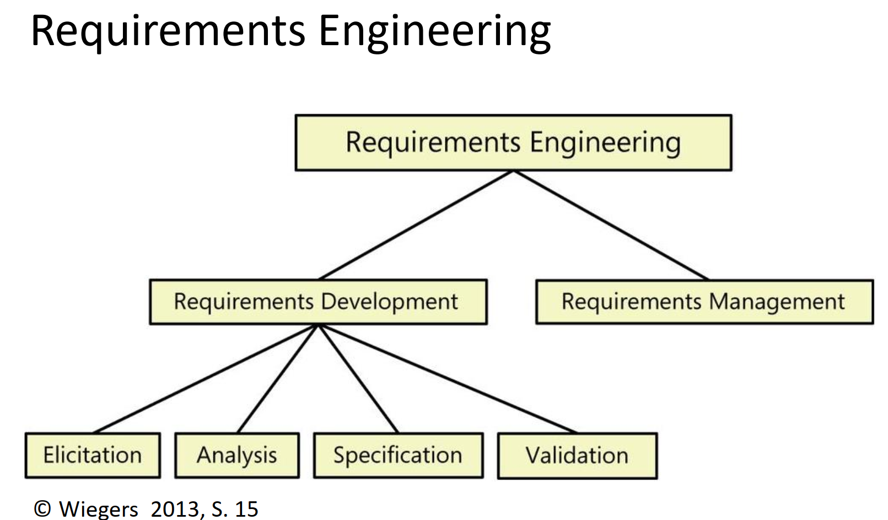
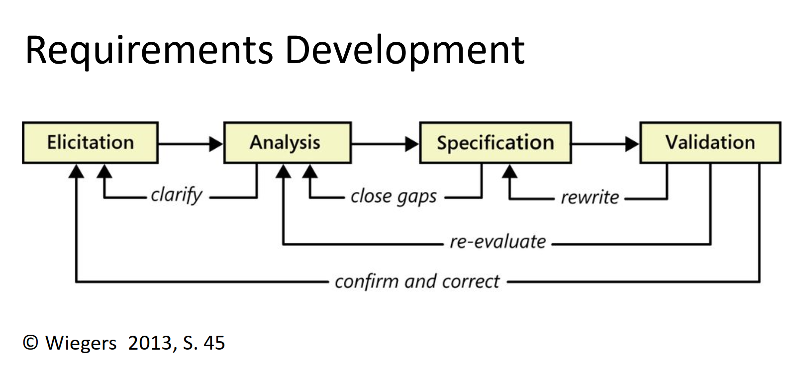
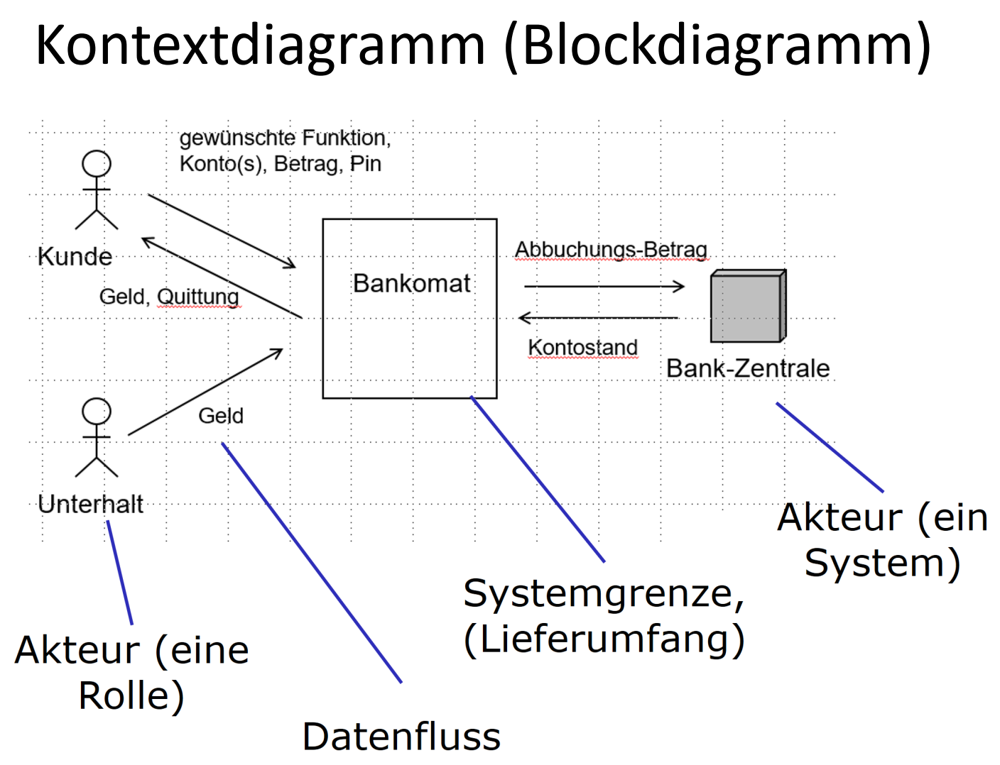
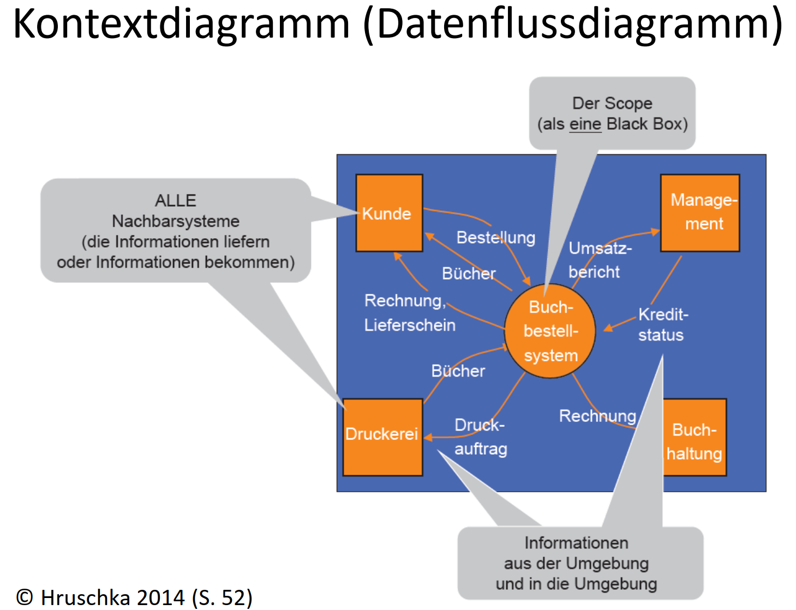
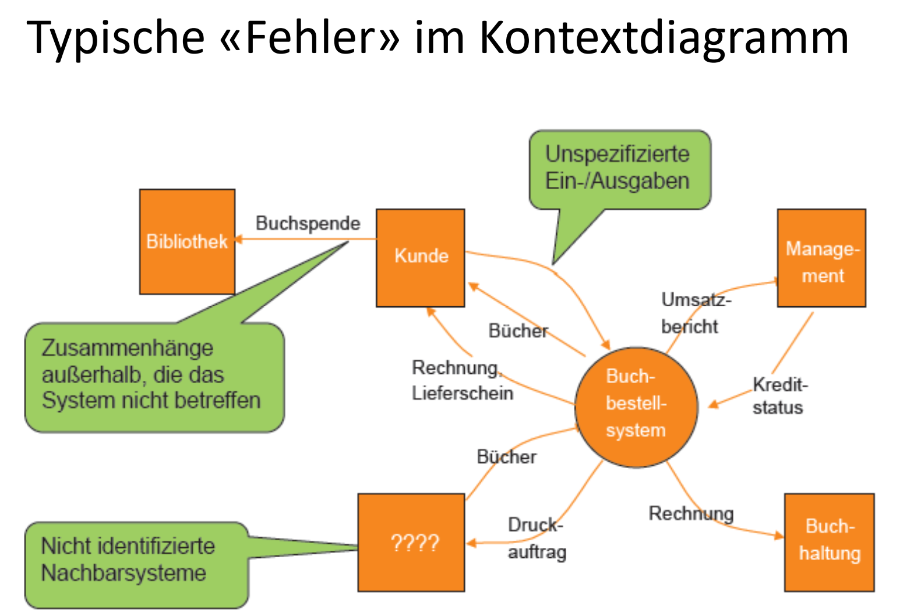
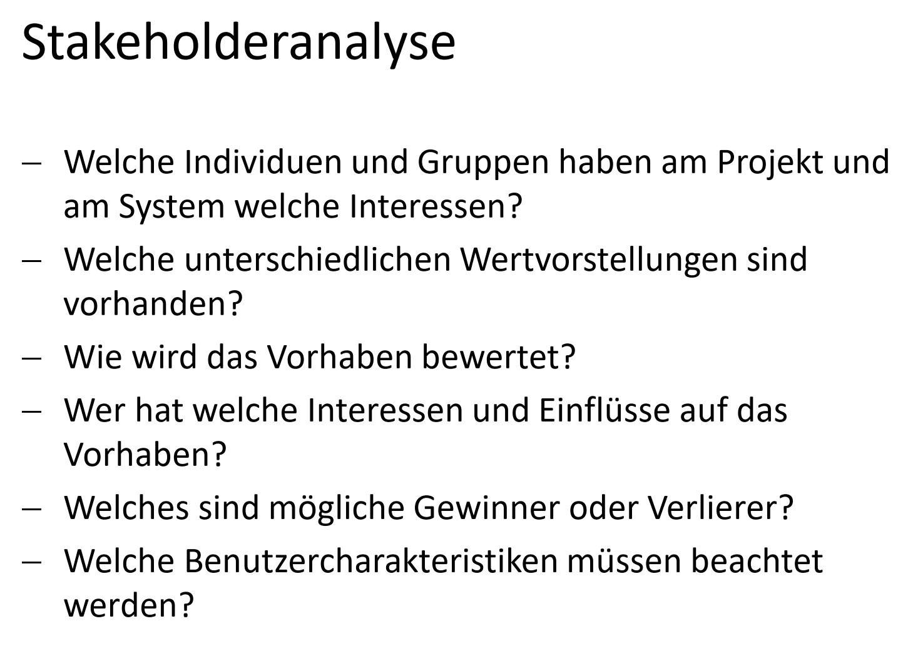
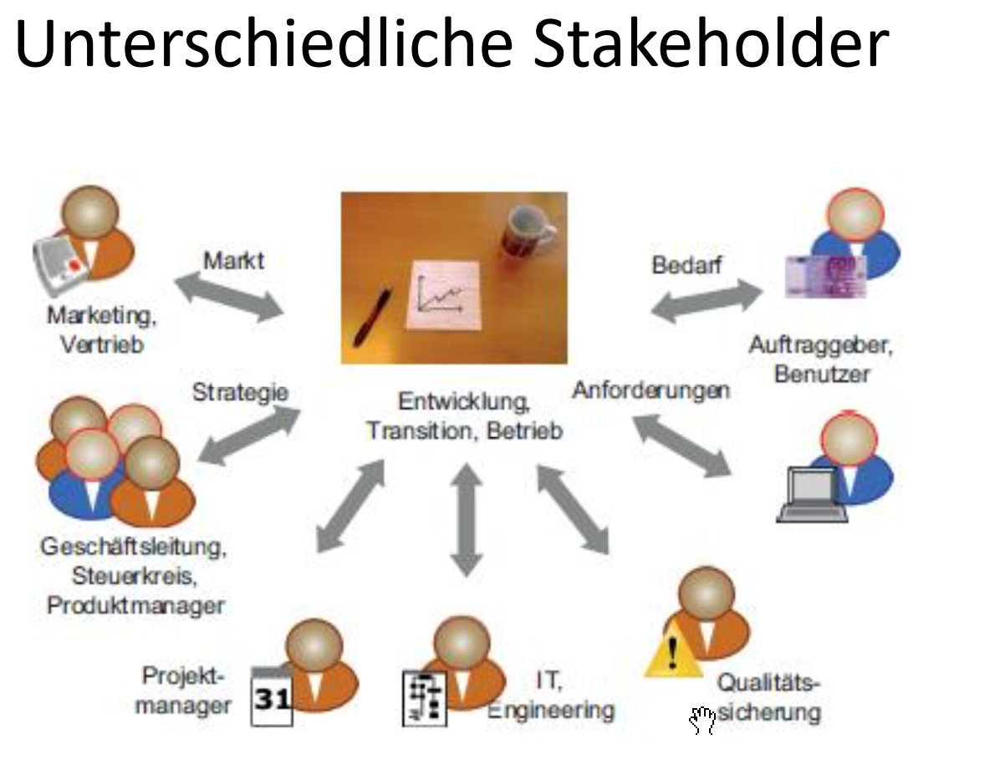
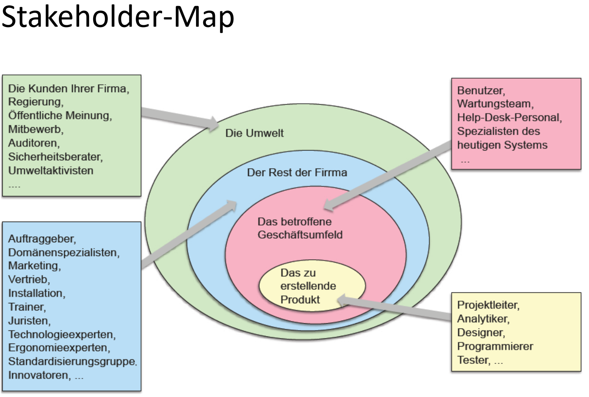
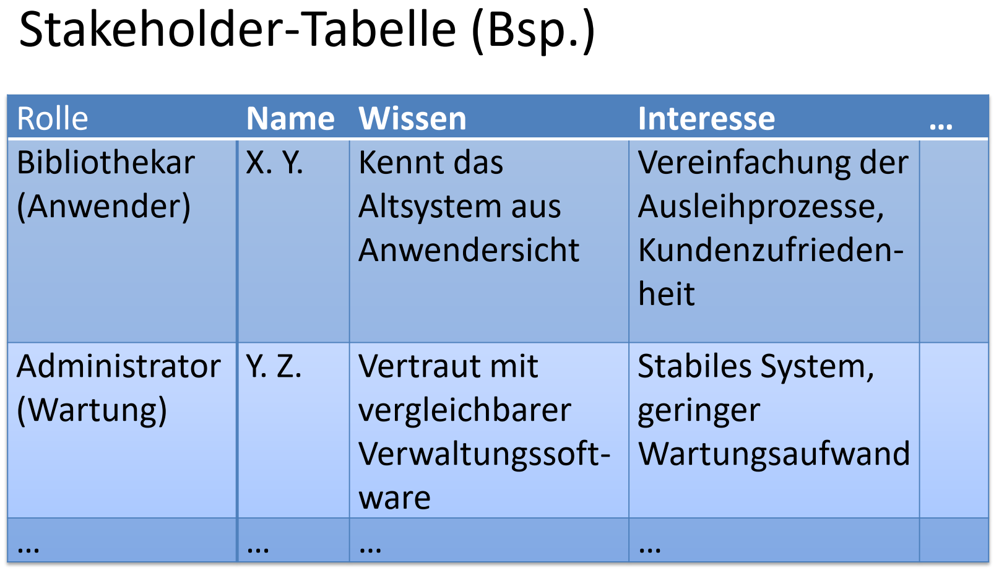

# Project Management and Requirements Engineering

**[Buch, VPN required](https://proquest.tech.safaribooksonline.de/9781457194306)**

- **Elicitation:** 
  Welche Erhebungstechnik eignet sich für welche Informationsbedürfnisse?
  Wie geht man vor um die nötigen Informationen in Erfahrung zu bringen?
- **Analysis:**
  Wie kann man die Resultate der Erhebung auswerten?
  Informationen strukturieren, Zusammenhänge herstellen
- **Specification:**
  Welche Artefakte, Dokumente, etc. sollen erstellt werden um das Wunschergebnis am besten zu beschreiben?
  Verstehen die Stakeholder diese Dokumente und erachten sie sie als sinnvoll?
- **Validation:**
  Wie kann man sich mit den Stakeholdern auf die zu realisierende Version einigen?

Die Regeln müssen nicht immer strikt eingehalten werden, wenn dadurch die Verständlichkeit für den Stakeholder damit erhöht werden kann.

