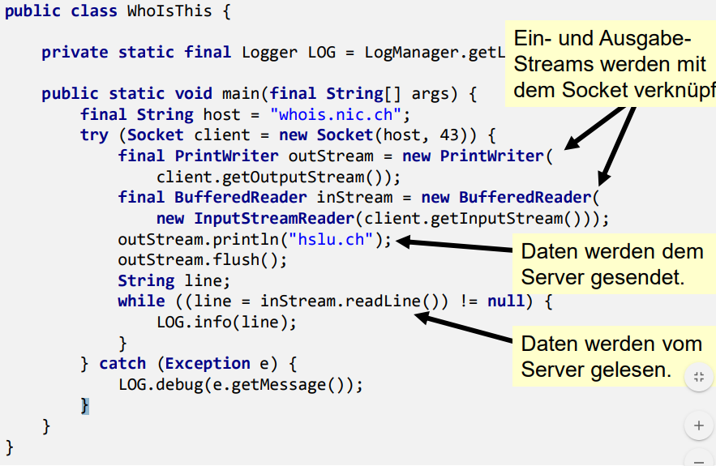
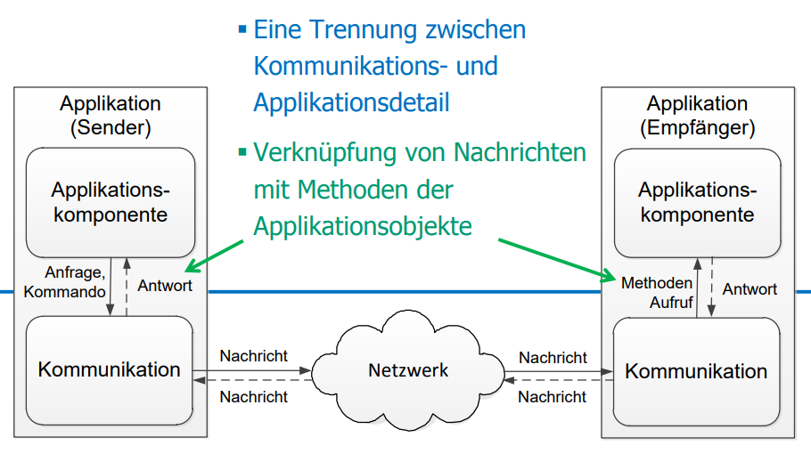
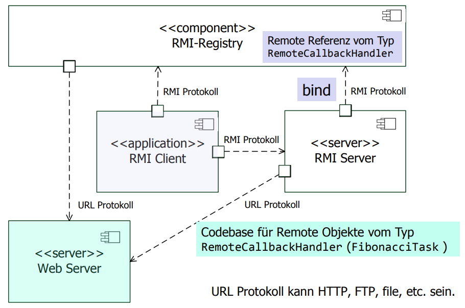

# Kommunikation in Systemen

[TOC]

### Sie kennen die wichtigsten Begriffe aus den Netzwerk Konzepten kennen, die man für die Java Netzwerkprogrammierung benötigt. 

Sie sind mit folgenden grundlegenden Begriffen vertraut:

- Host
- IP-Adresse
- IP(v4/v6)
- DNS
- ISO/OSI-Layer
- Ports 
- Sockets
- Protokolle (TCP, UDP)
- Client/Server Prinzip

### Sie wissen, welche Aktionen nötig sind, um Daten verbindungsorientiert senden zu können. 

Um Daten verbindungsorientiert zu versenden, sind folgende Aktionen nötig:

- Socket erzeugen
- Socket an einen lokalen      Port binden (Verbindung herstellen) 
- Daten über Socket      lesen/schreiben
- Socket schliessen

### Sie kennen den Lebenszyklus eines TCP Servers und können die einzelnen Elemente mit einem Java Programm in Beziehung stellen. 

Ein Server wird durch die Klasse ServerSocket repräsentiert. Der Lebenszyklus eines TCP Servers sieht wie folgt aus:

1. ServerSocket      mit Port erzeugen
2. Mit accept auf eine Verbindung warten
3. In- und Outputstreaam mit      dem Socket verknüpfen
4. Daten lesen und schreiben,      entsprechend dem vereinbarten Protokoll
5. Connection schliessen
6. Beim Schritt 2.      weitermachen oder ServerSocket schliessen

Der Dienst und die Kommunikation mit dem Client sollte nebenläufig ausgeführt werden.

Beispiel:

## Sie wissen was ein Netzwerk Interface ist und wie dieses in Java repräsentiert wird. 

Ein Netzwerk Interface ist ein Netzwerk Adapter NIC (network interface card). Ein Netzwerk Adapter kann auch eine Software sein, z.B. ein Loopback Interface (127.0.0.1 für IPv4 und :::1 für IPv6).

Heutige Rechner besitzen mehr als ein Netzwerk Adapter. Beim Erstellen des Server Sockets oder Datagramm Sockets kann (muss) der Netzwerk Adapter angegeben werden.

Die Klasse NetworkInterface repräsentiert eine Netzwerkschnittstelle. Die Netzwerk-Adapter können mit der Methode getNetworkInterfaces() ausgelesen werden.  Auf dem NetworkInterface können InetAdress des Interfaces mit getInetAddresses() ausgelesen werden.

Um einen Server Socket einem bestimmten Netzwerk Adapter zuzuordnen, stehen überladene Konstruktoren zur Verfügung. Zudem muss dem Server Socket noch die Grösse der Warteschlange (Parameter backlog) für anstehende Clients mitgegeben werden. Die Signatur des Konstruktors sieht wie folgt aus: 

```
ServerSocket (final int port, final int backlog, final InetAddress bindAddr) throws IOException
```

### Sie können sowohl Java Client-Programme sowie Java Server-Programme analysieren und implementieren. 



### Sie wissen was Persistenz von Objekten bedeutet. 

Die Persistenz von Objekten muss folgende Anforderungen erfüllen:

- **Transparenz**: Persistenz erfordert keine      Sonderbehandlung bei der Programmierung (Benutzer arbeiten in gleicher      Weise mit transienten sowie mit persistenten Objekten)
- **Interoperabilität**: Laufzeitumgebung und      persistenter Speicher sind austauschbar. Persistente Objekte können in      anderen Umgebungen verwendet werden.
- **Skalierbare      Wiederauffindbarkeit**: Das Auffinden von persistenten Objekten erfolgt transparent,      ohne spezifisches Durchsuchen von Objektpools.

Unter Java lassen sich Objekte über verschiedene Ansätze automatisch persistieren:

- **Standardserialisierung**: Binär via Java Object      Serialization (JOS)
- **XML-Serialisierung      über JavaBeans Persistence (JBP)**: Via XML, wird in der Praxis kaum mehr verwendet.
- **XML-Abbildung      über JAXB**: Via      XML. Teil der Standardbibliothek seit Java Version 6.

## Sie kennen den Standardmechanismus zur Serialisierung von Java-Objekten. 

**Ablauf**

Ablauf des Standardmechanismus zur Serialisierung eines Java- Objekts:

1. Metadaten, wie Klassenname      und Versionsnummer, in den Byte-Strom schreiben
2. alle nichtstatischen      Attribute (private, protected, public) serialisieren
3. die entstehenden Byte-Ströme      in einem bestimmten Format zu einem zusammenfassen

Bei der Deserialisierung wird dann der Datenstrom gelesen und ein Java Objekt mit dem gespeicherten Zustand erzeugt

**Standard-Serialisierung**

Es stehen zwei Klassen und ihre (De-)Serialisierungs-Methode zur Verfügung:

- **ObjectOutputStream**: Mit der Methode      writeObject() können Objekte in einen Ausgabestrom geschrieben werden.      Während der Serialisierung geht der ObjectOutputStream die Zustände und      Objektverweise rekursiv ab und schreibt die Zustände Schritt für Schritt      in einen Ausgabestrom
- **ObjectInputStream**: Mit der Methode      readObject() können serialisierte Objekte in ein Objekt der Laufzeit      umgewandelt werden.

 

Beispiel:

```java
final FileOutputStream outputStream = new FileOutputStream("datei"); 
final ObjectOutput output = new ObjectOutputStream(outputStream);

output.writeObject(new Integer(3));
output.flush();

final FileInputStream inputStream = new FileInputStream("datei"); final ObjectInputStream input = new ObjectInputStream(inputStream); 

final Integer integer = (Integer)input.readObject();
```

### Sie kennen das Prinzip der Java Object Serialization. 

Wenn eine beliebige Klasse das Interface java.io.Serializable implementiert, kann Java deren Instanzen serialisieren. Das Interface java.io.Serializable ist ein Marker-Interface, besitzt also keine Methoden. Ist dieses Interface implementiert, kann die Serialisierung entsprechend mit den Klassen `ObjectInputStream` und `ObjectInputStream` zu serialisieren.

Folgende Informationen und Daten zu einem Objekt werden serialisiert:

- Der vollständig qualifizierte Name der Klasse.
- Die Signatur der Klasse.
- Alle nicht-statischen, nicht-transienten Attribute.
- Weitere Objekte, auf welche die Objekt Attribute verweisen.
- Alle aus den Oberklassen geerbten Attribute.

#### Transiente Attribute

Ein transientes Attribut ist ein berechnetes Attribut. Oft \(aber nicht immer\) müssen transiente Attribute beim Deserialisieren initialisiert werden. Dazu gibt es die Methode `readResolve()`. Sie wird, wenn vorhanden, vom `ObjectInputStream` aufgerufen und kann eine Initialisierung vornehmen. Als Beispiel:

```java
 //... weitere Methoden der Klasse Customer
 public Object readResolve() {
 return new Customer(firstName, lastName);
 }
}
```

Das Java-Keyword `transient` kann eine Variable markieren, sodass diese nicht serialisiert wird.

```java
public class Customer implements Serializable {
 private final String firstName;
 private final String lastName;
 // name wird im Konstruktor zusammengesetzt und muss nicht serialisiert werden
 private transient final String name;
 public Customer(final String firstName, final String lastName) {
 	this.firstName = firstName;
 	this.lastName = lastName;
 	this.name = firstName + " " + lastName;
 }
}
```

### Sie wissen wie eine beliebige Klasse zu serialisieren und deserialisieren ist.

 TODO

 

### Sie kennen die Möglichkeiten der Serialisierung bei Vererbung. 

Ist eine Oberklasse einer serialisierbaren Klasse nicht serialisierbar, so werden ihre privaten Felder nicht serialisert. Beim Deserialisieren wird der Konstruktor ohne Argumente der ersten nichtserialisierbaren Oberklasse aufgerufen. In der Oberklasse muss ein Konstruktor ohne Argumente existieren! Alle Unterklassen einer serialisierbaren Klasse sind ebenfalls serialisierbar. Dabei muss die Unterklasse nicht extra mit dem Interface `Serializable` markiert werden.

 

### Sie wissen warum die Versionierung bei der Serialisierung wichtig ist und können Versionsnummern entsprechend einsetzen. 

Alle benötigten Klassen müssen beim Serialisieren und Deserialisieren im Classpath liegen. Serialisierung und Deserialisierung von Objekten können in unterschiedlichen JVMs erfolgen, die potenziell auf unterschiedlichen Plattformen laufen. Es kann sein, dass beliebig viel Zeit zwischen dem Schreiben und Lesen von Dateien liegt.

Serialisierte Objekte haben eine Versionsnummer. Objekte mit falscher Versionsnummer können nicht deserialisiert werden. Die Versionsnummer wird als statisches Attribut definiert. Beispiel:

```java
public static long serialVersionUID = 8365728189244278312L;
```


Ist keine Nummer angegeben, so benutzt Java einen Hashwert, der sich u.a. aus den Namen der Klassenattribute errechnet. Änderungen an der Klasse \(z.B. Hinzufügen einer Methode\) machen serialisierte Daten inkompatibel. Dies verhindert versehentliches Einlesen inkompatibler Daten. Durch Angabe einer serialVersionUID kann man Kompatibilität steuern, eventuell mit eigener readObject-Methode.

 

### Sie können die Code-Beispiele nachvollziehen und modifizieren. 

 TODO

 

### Sie wissen was Persistenz und Synchronität in der Kommunikation bedeutet. 

#### Nachrichtenorientierte Kommunikation

 Es wird zwischen folgenden Kommunikationsformen unterschieden:

- **Persistente Kommunikation**: Nachricht wird solange gespeichert bis der Empfänger bereit ist 
- **Transiente Kommunikation**: Nachricht wird nur so lange gespeichert, solange sendende und empfangende Applikation ausgeführtt wird
- **Asynchrone Kommunikation**: Sender wird fortgesetzt unmittelbar nach dem er seine Nachricht zur Übertragung weiter gegeben hat
- **Synchrone Kommunikation**: Der Sender wird blockiert bis die Nachricht an den Empfänger übermittelt wurde

#### Persistente Kommunikation

Es wird unterschieden zwischen:

- Persistenter synchroner Kommunikation (siehe oben)
- Persistenter asynchroner Kommunikation, vgl. Message Oriented Middleware wie z.B. Java Message Service (JMS)

#### Transiente Kommunikation

Es wird unterschieden zwischen:

- Empfangsbasierte transienter synchroner Kommunikation, vgl. TCP Socket Verbindungsaufbau
- Transiente asynchrone Kommunikation, vgl. UDP Socket
- Auslieferungsbasierte transiente synchrone Kommunikation, vgl. Asynchroner RCP
- Antwortbasierte transiente synchrone Kommunikation, vgl. RPC oder RMI

### Sie wissen was eine Nachricht ist und kennen die Prinzipien der Nachrichtenverarbeitung. 

**Eine Nachricht**:

* wird über einen Kommunikationskanal gesendet
* enthält eine Anzahl Elemente von bestimmten Datentypen:
  * ID: identifiziert die Nachricht (z.B. GET, POST, … bei HTTP); wird nicht immer benötigt. Bei strikten Interaktionen zwischen Kommunikationspartnern ist die ID unnötig. (z.B. Schach)
  * Argumente: können einfache Datentypen (Integer, Strings, Floating-point) sein
    * Vorteil: Argumente können direkt über DataInputStream und DataOutputStream gelesen und geschrieben werden.
    * Können zusätzliche Informationen enthalten, basierend auf der Art
      der Nachricht, z.B. eine Aktion oder Anfrage (Wandle X in Y und gibt
      Resultat zurück oder Berechne X mit Hilfe von A,B,C)

**Weshalb Nachrichten anstatt SOAP, CORBA, RMI?** 

Weil:

* die Kommunikation relativ simpel ist.
* der Transaktionsdurchsatz kritisch ist (realtime Anwendungen).
* die Entwicklungsresourcen limitiert sind (schnelle Systementwicklung steht über der Flexibilität).
* spezielle Netzwerkprotokolle benötigt werden.
* Remote Objektprotokolle nicht verfügbar sind (z.B. Applet-Browser unterstützt nicht RMI, CORBA, o.ä.).

#### Prinizipien



 

### Sie können Nachrichten für fixe oder adaptive Protokolle mit Hilfe des Basic- oder Adaptive-Message Typs nachvollziehen. 

### Fixe Protokolle

Bei fixen Protokollen sind für jede Art von Nachricht die Menge der möglichen Kennungen (IDs) und die möglichen Argumente vor der Kommunikaation bekannt. Es gibt keine Änderungen während der Kommunikation. Wird oft mit dem Entwurfsmuster Fabrikmethode umgesetzt.

### Adaptive Protokolle

Nachrichten Protokolle können während der Laufzeit ändern, z.B. können:

- Nachrichtentypen ändern
- Argumenttypen ändern
- die Länge der Argumentliste ändern 

Ein anpassbarer Message Handler bewältigt die Änderungen des Nachrichten Protokolls während der Laufzeit.
In der Praxis kommen Message Passing Systeme mit adaptiven Protokollen häufiger vor als diejenigen mit fixen Protokollen. Wird oft mit dem Entwurfsmster Prototyp umgesetzt.

### Sie kennen die Entwurfsmuster «Fabrikmethode» und «Prototyp».

#### Factory

> Der Begriff **Fabrikmethode** ([englisch](https://de.wikipedia.org/wiki/Englische_Sprache) **factory method**) bezeichnet ein [Entwurfsmuster](https://de.wikipedia.org/wiki/Entwurfsmuster) aus dem Bereich der [Softwareentwicklung](https://de.wikipedia.org/wiki/Softwareentwicklung). Das Muster beschreibt, wie ein [Objekt](https://de.wikipedia.org/wiki/Objekt_(Programmierung)) durch Aufruf einer [Methode](https://de.wikipedia.org/wiki/Methode_(Softwaretechnik)) anstatt durch direkten Aufruf eines [Konstruktors](https://de.wikipedia.org/wiki/Konstruktor) erzeugt wird. Es gehört somit zur Kategorie der [Erzeugungsmuster](https://de.wikipedia.org/wiki/Erzeugungsmuster) (engl. *creational patterns*).

[](https://de.wikipedia.org/wiki/Datei:Fabrikmethode.svg)

#### Prototyp

> Ein **Prototyp** ([engl.](https://de.wikipedia.org/wiki/Englische_Sprache) *prototype*) ist ein [Entwurfsmuster](https://de.wikipedia.org/wiki/Entwurfsmuster) (*design pattern*) aus dem Bereich der [Softwareentwicklung](https://de.wikipedia.org/wiki/Softwareentwicklung) und gehört zur Kategorie der [Erzeugungsmuster](https://de.wikipedia.org/wiki/Erzeugungsmuster) (engl. *creational patterns*). Neue [Instanzen](https://de.wikipedia.org/wiki/Objekt_(Programmierung)) werden auf Grundlage von prototypischen Instanzen („Vorlagen“) erzeugt. Dabei wird die Vorlage kopiert 

[](https://de.wikipedia.org/wiki/Datei:Prototyp.svg)


# Verteilte Systeme (R. Diehl)

### Sie kennen zwei verschiedene Algorithmen zur Synchronisation von physischen Uhren.

### Algorithmus von Cristian

Cristians Algorithmus dient der Zeitsynchronisation von clientseitigen Prozessen mit einem Timeserver. Der Algorithmus funktioniert gut in Netzwerken mit tiefer  Latenz, in welchen die Round-Trip-Zeit kurz ist. Für verteilte Systeme oder Applikationen mit hoher Redundanz ist der Algorithmus nicht geeignet.

> Die _Round-Trip-Zeit_ (RTT) bezeichnet hier die Zeit zwischen Start einer Abfrage (Request) und dem Ende der zugehörigen Anwtort (Response).

#### Zeitserver (time server)

Der Zeitserver ist eine Maschine mit Zeitzeichen-Empfänger. 
Mit diesem Server werden alle anderen Maschinen synchronisiert.
Zu Beginn jeder UTC-Sekunde sendet der Zeitzeichensender einen kurzen Impuls.

> "_UTC_" steht für _Universal Coordinated Time_, die Zeitmessung in Beziehung zum Sonnenstand mit Schaltsekunden.

#### Implementation

- Client _P_ erfragt die Zeit vom Zeitserver _S_ zum Zeitpunkt _t0_
- Die Anfrage wird von _S_ verarbeitet - dies benötigt eine Zeitspanne _I_
- Die Antwort _C(t1)_ (UTC) wird ovn P zum Zeitpunkt _t1_ empfangen.
- _P_ wird auf die Zeit _C(t1)_ + RTT/2 gesetzt, d.h. die vom Server gemeldete Zeit plus die Rücklaufzeit des Pakets
  - Berechnung RTT = _t1_ - _t0_ 
  - ist die Zeitspanne _I_ bekannt, kann die Berechnung verbessert werden: RTT = _t1_ - _t0_ - _I_
- Eine häufigere Messung der Laufzeit wird durchgeführt, um genauere Werte zu erreichen.
- Messungen auserhalb eines Bereiches werden verworfen.
- Von den verbleibenden Werten wird das Mittel verwendet.

#### Probleme

##### Zeit in Vergangenheit

Die Zeit vom Zeitserver liegt in der Vergangenheit der lokalen Zeit. Die Uhr kann nicht einfach zurückgedreht werden, da inkonsistente Zustände im System entstehen könnten.
Hierbei handelt es sich um ein _grosses Problem_.

### **Lösung:** Die lokale Zeit wird verlangsamt, bis die Zeitdifferenz ausgeglichen ist.

##### Rücklaufzeit

Das kleinere der beiden Probleme des Algorithmus von Cristian ist die Zeit (_I_), welche vom Server benötigt wird, bis er eine Antwort sendet.
Diese Laufzeit kann nicht genau bestimmt werden, denn sie ist abhängig von der Netzwerklast.

**Lösung:** Die Zeit _I_ wird durch mehrfache Messung der Dauer der Anfrage kompensiert. 
Der vom Zeitserver gelieferte Wert kann so adaptiert werden.

#### Berkeley-Algorithmus

Anders als beim Algorithmus von Cristian hat beim _Berkley_-Algorithmus keine Maschine einen Zeitzeichen-Empfänger.
Der Zeitserver (Zeit-Daemon) fragt periodisch alle Maschinen nach ihrer Zeit.
Basierend auf den Antworten dieser berechnet der Zeitserver die Durchschnittszeit.
Anschliessend weist er alle Maschinen an, ihre Uhren an diese neue Zeit anzupassen.

#### Network Time Protocol (NTP)

Das seit 1982 entwickelte Protokoll (aktuelle Version NTP v4 seit 1994) dient der Synchronisierung von Rechneruhren im Internet.
Auf fast allen Rechnerplattformen (von PCs bis Crays, Unix, Windows, VMs, embedded systems) sind NTP-Dämone verfügbar.
Durch die Verwendung des Protokolls und des Dämons kann in einem WAN (world access network, Internet) eine Genauigkeit von ca. 0.01s erreicht werden.
In LANs ist gar eine Genauigkeit kleiner als 1ms möglich.

### Struktur

- **Stratum 1:** primärer Zeitgeber, über Funk oder Standleitungen an amtliche Zeitstandards angebunden
- **Stratum >1:**  synchronisiert mit Zeitgeber des Stratums _i-1_

> Das Stratum kann dynamisch wechseln, z.B. bei Unterhalt oder Ausfall der Verbindung


## Sie wissen was eine logische Uhr ist.

Im Jahr 1978 zeigte Leslie Lamport, dass eine Einigkeit bzw. Übereinstimmung der Zeit aller Maschinen innerhalb eines bestimmten Systems ausreicht.
Eine Übereinstimmung mit der Zeit ausserhalb des Systems bzw. eine "echte" UTC ist nicht notwendig.
Logische Uhren finden ihre Anwendung vor allem in Breichen mit hohem Anspruch an Kausalität und Verlässlichkeit. Die Verfahren zur Synchronisation von logischen Uhren in grossen Systemen ist im Allgemeinen jedoch ineffizient.

## Sie kennen die Happened-Before-Relation.

Lamport stellte auch die _Happened-Before-Relation_ auf. Der Ausdruck $a \rightarrow b$  wird gelesen als "_a_ passiert vor _b_". 
Dies bedeutet, dass sich **alle Prozese einig sind**, dass **zuerst das Ereignis _a_** und **dann das Ereignis _b_** stattfindet. Es gilt ebenfalls die Transitivität falls $a \rightarrow b$ und $b \rightarrow c$, dann gilt $a \rightarrow c$

## Sie kennen den Algorithmus des Lamport-Zeitstempels zur Synchronisation von logischen Uhren.

#### Ausgangslage

Jede Maschine hat eine eigene Uhr mit konstanten aber unterschiedlichen Geschwindigkeiten.

Beim Lamport-Zeitstempel sendet ein Prozess eine Nachricht mit der eigenen Uhrzeit an einen anderen Prozess.
Einem Ereignis _a_ wird ein zeitwert _C(a)_ zugeordnet. Alle Prozesse sind sich über den Zeitwert einig.
Wenn _a_ vor _b_ gilt, gilt auch _C(a)_ < _C(b)_.
Ein Prozess sendet eine Nachricht mit eigener Uhrzeit _a_ an einen anderen Prozess, welcher die Nachricht zur eigenen Zeit _b_ empfängt. Dann müssen _C(a)_ und _C(b)_ so zugewiesen werden, dass _C(a)_ < _C(b)_ ist.

Die Uhrzeit C muss **immer vorwärts laufen**.
Korrekturen können durch **Addition von positiven Werten** vorgenommen werden.

#### Lösung

Zwischen zwei Ereignissen muss die lokale Uhr mindestens einmal ticken - _empfangene Zeit_ + 1.


> Es gibt nie zwei EReignsise, die zu genau der selben (logischen) Zeit auftreten.

Die Lösung liegt darin, die **Prozessnummer dem Zeitstempel hinzuzufügen**.

Damit kann allen Ereignissen in einem verteilten System eine Zeit zugewisen werden, die folgenden Bedingungen genügt:

1. wenn _a_ im selben Prozess vor _b_ auftritt, gilt _C(a)_ < _C(b)_.
2. wenn _a_ und _b_ das Senden und Empfangen einer Nachricht darstellen, gilt _C(a)_ < _C(b)_.
3. für allen anderen Ereignisse _a_ und _b_ gilt _C(a)_ != _C(b)_.

### Lamports Uhren

See also: https://www.youtube.com/watch?v=CMBjvCzDVkY

### Eigenschaften

Lamports Uhren erfüllen die Uhrenbedingung! 
Die logischen Lamport-Zeitstempel _L(e)_ definieren daher eine parteille Ordnung auf der Menge der Ereignisse,
die den kausalen Zusammenhang zwischen Ereignissen erhält.
Eine Ergänzung zu einer totalen Ordnung ist wieder möglich.

### Problem: Anahnd der Zeitstempel lässt sich nicht immer sicher sagen, ob zwei Ereignisse kausal voneinander abhängen.

Hierfür müsste auch die Umkehrung der Uhrenbedingung gelten, es gilt aber lediglich _C(a)_ < _C(b)_ --> a vor b V a || b.

## Sie kennen den Algorithmus des Vektor-Zeitstempels zur Synchronisation von logischen Uhren.

See also: <https://www.youtube.com/watch?v=jD4ECsieFbE>

Ein Vektor-Zeitstempel _VT(a)_, der einem Ereignis _a_ zugewiesen wurde, hat die Egenschaft, dass Ereignis _a_
 dem Ereignis b kausal vorausgeht, wenn _VT(a)_ < _VT(b)_ für ein Ereignis _b_ gilt.

 Jeder Prozess _Pi_ besitzt einen Vektor _Vi_, der für jedenProzess im System die Anzahl der Ereignisse enthält 
 mit den Eigenschaften: 

1. _Vi_[i] ist die Anzahl der Ereignisse, die bisher in _Pi_ aufgetreten sind
2. _Vi_[j] = k, erkennt _Pi_, dass in _Pj_ k Ereignisse aufgetreten sind
3. Der Vektor _Vi_ wird den gesendeten Nachrichten mitgegeben.

Jeder Prozess hat einen Vektor an Uhren (Integer Clock). Angenommen es gibt `N` Prozesse (in einer Gruppe von Prozessen `1..N`). Jeder Vektor hat `N` Elemente. Der Prozess `i` hat einen Vektor $V_i[1..N]$.

Das j-the Element im Vektor vom Prozess i (also $V_i[j]$) ist die Zeit (aus Perspektive Prozess i) vom letzten Event des Prozesses j.

Zu Beginn ist der Vektor der Nullvektor.

### Vektor-Zeit inkrementieren

Bei einer Instruktion oder einem gesendeten Event bei Prozess i, der Prozess inkrementiert nur sein i-tes Element des Vektors. Jede Nachricht trägt den Vektor-Zeitstempel des sendenden Prozesses mit.

Erhält Prozess $$i$$ von Prozess $$j$$ eine Nachricht passiert:

- $$V_i[i] = V_i[i] + 1$$
- $$V_i[j] = max(V_\text{message}[j], V_i[j]) \text{for}  j \neq i$$

Also: Der Prozess inkrementiert seinen Vektor an i-ter Stelle und aktualisiert den Zeitstempel an der j-ten Stelle um den höheren Wert zwischen dem gespeicherten und dem mit gesendeten Wert.

### Kausalität

- Zwei Vektor-Zeitstempel sind gleich ($$VT_1 = VT_2$$) falls $$VT_1[i] = VT_2[i]$$ für alle $$i = 1, ..., N$$
- Ein Vektor-Zeitstempel ist kleiner oder gleich ein anderer Vektor ($$VT_1 \le VT_2$$) falls $$VT_1[i] \le VT_2[i]$$ für alle $$i = 1, ..., N$$
- Zwei Events sind **kausal**, z.B. $$VT_1$$ erfolgt vor $$VT_2$$ ($$VT_1 < VT_2$$) falls:
  - $$VT_1 \le VT_2$$ und
  - Es existiert ein $$j$$ sodass $$1 \le j \le N$$ und $$VT_1[j] < VT_2[

## Sie können die Algorithmen zur Synchronisation von logischen Uhren in einem Programm nachvollziehen

TODO


## Sie können den Begriff Middleware erklären und wissen in welche Middleware Kategorien RMI einzuordnen ist

### Middleware

Middleware (englisch für Dienste-Schicht oder Zwischenanwendung) oder Vermittlungssoftware bezeichnet in der Informatik anwendungsneutrale Programme, die so zwischen Anwendungen vermitteln, dass die Komplexität dieser Applikationen und ihre Infrastruktur verborgen werden.

Sie sind transparent in Bezug auf [verschiedene Aspekte](#transparenz).

#### Kategorien

Middlewares werden in die folgenden Kategorien unterteilt:

- **Kommunikationsorientiert**: Der Schwerpunkt liegt in der Abstraktion der Netzwerkprogrammierung (RPC, **RMI**, Web-Service)
- **Nachrichtenorientiert**: Arbeitet über Austausch von Nachrichten mithilfe von Warteschlangen (JMS, SOAP)
- **Anwendungsorientiert**: Im Mittelpunkt steht neben Kommunikation v.a. die Unterstützung verteilter Anwendungen (Hazelcast, JEE, Microsoft .NET und WCF, CORBA)


## Sie wissen was mit Transparenz gemeint ist und kennen die drei gängigsten Transparenzen.

- **Ortstransparenz:** Benutzer kennt Lokation einer Ressource oder eines Dienstes nicht
- **Zugriffstransparent:** Zugriff auf Ressource erfolgt immer identisch, egal ob sich diese lokal oder entfernt im Netz befindet.
- **Nebenläufigkeitstransparenz:** Mehrbenutzerbetrieb wird von Diensten und Ressourcen unterstützt. Das System ermöglicht exklusive Zugriffe und Datensynchronisation und -replikation.
- **Fehler- und Ausfalltransparenz:** Typische durch Verteilung entstehende Fehler (Übertragungsfehler, Komponentenausfall etc.) bleiben der Anwendung weitgehend verborgen.
- **Sprachtransparenz:** Die Kommunikation zwischen den Komponenten ist unabhängig von der jeweils verwendeten Programmiersprache.
- **Replikationstransparenz:** Aus Performancegründen kann es mehrere Kopien derselben Ressource geben. Das System sorgt für die transparente Änderung der darin vorgenommenen Änderungen.

## Sie kennen zwei Architekturmodelle von verteilten Systemen und können erklären was eine Multi-Tier Architektur ist.

### Client-Server / Peer-to-Peer

- Client-Server: langlebender Server, kurzlebende Client-Prozesse
- Peer-to-Peer: Gleichberechtigte Prozesse laufen lokal und tauschen nur bei Bedarf untereinander Informationen aus, es wird kein zentraler Prozess benötigt.

### Fat-Client und Thin-Client

- Fat-Client: Verarbeitung der Daten i.d.R. vor Ort vollzogen, oftmals stellt es auch ein GUI zur Verfügung
- Thin-Client: Stark auf die Hilfe anderer Computer oder Server angewiesen ist um seine Computeraufgaben zu erfüllen

### Multi-Tier Architektur (2-Tier, 3-Tier und n-Tier)

- 2-Tier: Präsentation, Anwendungslogik und Datenhaltung auf zwei Anwendungen verteilt
- 3-Tier: Die Anwendungslogik erhält einen eigenen Tier
- n-Tier: Verteilung der Anwendungslogik und Datenhaltung auf mehrere Tiers

## Sie kennen das RMI Prinzip und wissen wozu die notwendigen Komponenten dienen.

- Bereitstellung von einer oder mehrere Methoden in einem Remote-Interface. Diese Methoden sollen als Dienste zur Verfügung stehen.
- Server-Klasse implementiert Interface
  - Instanzen davon heissen Remote-Objekte
  - Remote-Objekte werden bei Namens-Service registriert
  - Clients können Dienst dort anfordern
- Clients fordern mithilfe des Namensservices die Remote-Referenz der benötigten Objekte und können dann die entsprechenden Methoden darauf aufrufen
- Übertragung der Parameter und des Rückgabewertes sind für Server sowie Client transparent.

### Technische Realisierung


- **Client-Stub**: Stellvertreterobjekt, identische Schnittstelle wie Remote-Objekt; befindet sich auf selbem Rechner wie Client 
- **Server-Stub**: befindet sich auf Server, nimmt Aufrufe von Client-Stub entgegen
- **Remote Method Procotol**: regelt Kommunikation auf Basis von TCP/IP Verbindungen
- **RMI-Transportschicht**: Hier kommunizieren die beiden Stubs miteinander. Der Server-Stub kennt das tatsächliche Remote-Objekt, leitet die Anfragen des CLient-Stubs entsprechend weiter und gibt den Rückgabewert an den Client zurück

## Sie wissen in den Grundzügen wie RMI auf Client- und Serverseite mit Hilfe von Stellvertreterobjekten funktionieren.

siehe oben.

## Sie kennen die Voraussetzungen, welche für Parameter und Rückgabewerte bei RMI gelten.

- Elementare Datentypen: können wie gewöhnlich *by value* übergeben werden.
- Lokale Objekte: können nur übergeben werden (oder als Rückgabewerte), wenn sie serialisierbar sind (Implementation des `Serializable` Interfaces); werden als Kopie übergeben (also auch *by value*)
- Verweise auf Remote-Objekte: werden z.B. vom Namensservice zurückgegeben und werden als Objektreferenzen (*by reference*) behandelt.

## Sie können in Java die Schnittstelle für Remote Objekte definieren, die Remote Objekte anhand der Schnittstelle implementieren und bei einem Namens-Service registrieren

##### 1. Remote-Interface definieren

- Jedes Remote-Objekt muss Interface `Remote` implementieren
    - beschreibt die Funktioenn, die auf Server zur Verfügung stehen
    - auch Parameter/Rückgabewerte eines Interfacetypes
- Jede angebotene Methode kann eine `RemoteException` auslösen
- Parameter/Rückgabewerte: müssen serializable sein, Laden von Byte-Code automatisch möglich

```java
public interface RemoteFibonacci extends Remote {
    public BigInteger calc(int value) throws RemoteException;
}
```

##### 2. Remote-Interface implementieren

- Um eingehende externe Methodenaufrufe zu behandeln muss jedes Remote-Objekt in die RMI Infrastruktur exportiert werden. Möglichkeiten:
    1. Ableitung der Klasse `UnicastRemoteObject` und Implementation des RMI-Interfaces
    2. Remote-Objekt implementiert RMI-Interface und wird mithilfe der Klassen-Methode `UnicastRemoteObject.exportObject(...)` exportiert.
- Infrastruktur generiert dann die zugehörige URL für Remote Method Protocol

```java
public class FibonacciImpl extends UnicastRemoteObject
implements RemoteFibonacci {
 public FibonacciImpl() throws RemoteException {
 super();
 }
 @Override
 public BigInteger calc(int value) throws RemoteException {
 BigInteger fibonacci;
 fibonacci = FibonacciCalculator.getFibonacci(
 new BigInteger(Integer.toString(value)));
 return fibonacci;
 }
}
```

##### 3. RMI-Repository starten

- Infrastruktur für das Binding ist der RMI Namensdienst
    - rmiregistry.exe: Repository erreichbar über RMI-URL
    - ansprechbar über Methoden des Pakets `java.rmi.registry`
- Reskriktion: RMI-Server kann nur Referenzen von Remote-Objekten in Registry registrieren, die  auf demselben Host laufen
    - Sicherheitsrisiko: Ansonsten könnte RMI-Client Registryeinträge entfernen oder verändern
- RMI-Registry ist Abbildung ovn Namen auf Remote-Objekte
    - Hierarchische Namensräume, dynamische Objektsuche, Lastverteilung oder ähnliche Eigenschaften fehlen
    - Alternative: Java Naming and Directory Interface (JNDI)

##### 4. Remote-Objekte erzeugen

 - Factory-Methode `LocateRegistry.createRegistry(int portNumber)`
 - Standard-Port 1099
 - Programm `RegistrySetup` darf nicht beenden

 ```java
public final class RegistrySetup {
 public static void main(final String[] args) throws RemoteException, InterruptedException {
    final Registry reg = LocateRegistry.createRegistry(Registry.REGISTRY_PORT);
    LOG.info("o.k.");
    synchronized (reg) {
        reg.wait();
    }
 }
}
 ```

##### 5. Remote-Objekte registrieren

- Klasse Naming stellt Funktionen zur Registrierung von  Remote-Objekten zur Verfügung:

```java
public static void bind(String name, Remote obj)
 throws AlreadyBoundException, MalformedURLException,
 RemoteException;
public static void rebind(String name, Remote obj)
 throws RemoteException, MalformedURLException
public static void unbind(String name)
 throws RemoteException, MalformedURLException, NotBoundException
public static Remote lookup(String name)
 throws NotBoundException, MalformedURLException, RemoteException
public static String[] list(String name)
 throws RemoteException, MalformedURLException
```

####### Vorgang

1. Remote-Objekt erzeugen
2. Nach Start des RMI-Namensdiensts kann Remote-Objekt registriert werden

```java
public class FibonacciServer {
    public static void main(String[] args)
        throws RemoteException, AlreadyBoundException, MalformedURLException {
        final FibonacciImpl fibo = new FibonacciImpl();
        final String url = "rmi://localhost:1099/fibo";
        Naming.bind(url, fibo);
    }
}
```

> Werden Bytecode-Klassen dynamisch per RMI geladen, so wird eine Installation des SecurityManagers notwendig.

##### 6. Client implementieren

- Client sucht Referenz zum Remote-Objekt mittels `Naming.lookup(String url)`

```java
public class FibonacciClient {
    public static void main(String[] args) {
        try {
            final int value = 123;
            final String url = "rmi://localhost:1099/fibo";
            final var fibo = (RemoteFibonacci) Naming.lookup(url);
            BigInteger reslult = fibo.calc(value);
            // do something with result
        }
        catch (NotBoundException | MalformedURLException |RemoteException e) {
            LOG.fatal(e.getMessage());
        }
    }
}
```


## Sie können RMI Clients auf die Remote Objekte zugreifen lassen.

Siehe oben (Schritt 6 öppe ungefähr)

## Sie kennen das Push Prinzip für RMI und können es an Code Beispielen nachvollziehen.

### RMI Push Prinzip

- Das Remote-Interface bietet eine Registrierungsmethode als Dienst zur Verfügung
- Der Server (hier Logger Server) implementiert dieses Interface und erzeugt eine Remote-Instanz, diese Instanz wird bei der Registry registriert
- Der Viewer erzeugt ein Remote Push Receiver und exportiert diesen in die RMI Runtime (implizit oder explizit möglich)
- Der Viewer holt sich die Remote-Referenz zum Server und registriert sich (übergibt den Receiver für den Remote Push)
- Der Server ruft den Receiver bei Bedarf auf, um Nachrichten an den Client zu senden

#### Callback Beispiel (Fibonacci)

- Der Server stellt einen Dienst zur Berechnung einer Fibonacci Zahl zur Verfügung (kann bei grossen Zahlen eine längere Zeit dauern). Dazu ruft der Server intern die Methode `calc` auf.
- Wenn der Client die Methode des Server aufruft gibt er eine Referenz zu sich mit
- Der Fibonacci rechnet die Zahl asynchron und benachrichtigt den Client nach Abschluss der Berechnung. Dies macht er über ein Callback des Clients. Der Client stellt also eine Methode zur Verfügung (z.B. `handle`), die der Server aufrufen kann

Aufbau:

- Remote Schnittstellen:
  - `RemoteFibonacci` für die Berechnung der Fibonacci Zahl
  - `RemoteCallbackHandler` für den Callback
- RMI Server
  - `FibonacciImpl` implementiert den Server-Dienst zur Berechnung
  - `Request`, hier wird die eigentliche Berechnung durchgeführt
  - `FibonacciServer` erstellt die RMI Registry, erzeugt das Remote Objekt (`FibonacciImpl`)
- RMI Client
  - `FibonacciTask` implementiert den Callback und den Aufruf der Remote Methode `calc`
  - `FibonacciClient` erzeugt einen `FibonacciTask` und lässt diesen asynchron / nebenläufig ausführen

## Sie wissen welche Komponenten notwendig sind, um eine RMI Applikation zu verteilen.

#### Verwendung der RMI Registry vom Server

- Server holt sich über die Methode `getRegistry` der Klasse `LocateRegistry` eine Referenz zur lokalen Registry. Aus Sicherheitsgründen kann ein RMI Server Referenzen von Remote Objekten nur in einer lokalen Registry registrieren
- `getRegistry` ermöglicht eine Referenz zur Registry auf dem lokalen Host auf einem Default Port (1099) oder einem spezifizierten Port.

#### Verwendung der RMI Registry vom Client

- Der RMI Client holt sich mit Hilfe der Klasse LocateRegistry und der Methode getRegistry eine Referenz zur Registry.
- Die getRegistry Methode ermöglicht eine Referenz zur Registry
  - auf dem lokalen Host am Default Port (1099) oder
  - auf dem lokalen Host an einem spezifizierten Port oder
  - auf einen entfernten Host am Default Port oder
  - auf einen entfernten Host an einem spezifizierten Port.

## Sie können eine Codebase definieren und wissen welche Komponente den Code bereitstellen muss.

Bei Ausführung von RMI Applikationen wird immer Byte-Code geladen. Der Byte-Code wird nach folgendem Muster gesucht:

- In den lokalen Verzeichnissen (lokale Code Basis)
- In den entfernten Verzeichnissen (definierte Code Basis)

RMI Anwendungen haben die Wahl zwischen zwei Mechanismen, um Referenzen auf Remote-Objekte zu erhalten:

- Eine Anwendung kann ihre Remote-Objekte mit RMI Naming
  Methoden bei der RMI-Registry registrieren.
- Eine Anwendung kann ihre Remote-Objekte mit Hilfe der
  Klassen-Methode UnicastRemoteObject.exportObject
  exportieren.

Die Kommunikation mit Remote-Objekten wird durch die RMIMiddleware gehandhabt. Die Kommunikation ist transparent.

Wird Klassen-Bytecode für Objekte, die als Parameter oder Rückgabewerte übergeben werden, benötigt, stellt  RMI die erforderlichen Mechanismen zum Laden des Codes eines Objekts sowie zum Übertragen seiner Daten bereit.

#### Beispiel am Fibonacci Calculator



Codebase einrichten:

- Das Property `java.rmi.server.codebase` gibt die Codebase an, für Klassen welche die JVM benötigt. Das Property wird via `System.setProperty(...)` gesetzt, z.B. `System.setProperty("java.rmi.server.codebase", "http://localhost:8080/")`
- Sobald Code von Remote geladen wird ist ein Security Manager notwendig

Codebase zur Verfügung stellen:

- Am einfachsten: Die Klassen-Bytecode via HTTP-Server zur Verfügung stellen
- Wichtig: Der HTTP-Server benötigt Zugriff auf die .class-Dateien (und keine Java Archives (jar)!)
- JDK hat selbst einen HTTP-Server (in den neuen Versionen nicht mehr dabei), oder via Nginx/Apache oder ähnliches (z.B. mit Python `python -m http.server 8080`)


## Sie wissen, wie ein Security Manager in den Grundzügen funktioniert und können einen Security Manager für Ihr verteiltes RMI System konfigurieren und aktivieren

Java unterscheidet zwischen lokalem und remote Code bezüglich der Sicherheitsanforderungen:

- Lokaler Code hat Zugriff auf alle verfügbaren Ressourcen
- Remote Code hat eingeschränkten Zugriff, er kann z.B. nicht:
  - auf Dateien auf dem lokalen Computer zugreifen
  - Netzwerkverbindungen öffnen, die auf einen anderen Host als von dem der Code geladen wurde verbinden
  - Netzwerkverbindungen auf privilegierten Ports (< 1024) akzeptieren
  - Lesen von benutzerbezogenen System-Properties ("user.name", "user.home" etc)
  - Ausführen von externen Programmen
  - Laden von System-Libraries

#### Security Manager aktivieren

- `java.lang.SecurityManager` (seit JDK1.2) bietet eine Default-Implementierung an, die folgende Möglichkeiten hat:
  - Aktivieren über die Kommandozeile via `-Djava.security.manager`
  - Instanziieren des SecurityManagers via `System.setSecurityManager(new SecurityManager())`
  - `System.getSecurityManager()` prüft ob ein Security Manager aktiviert ist
- Man kann eine eigene Security Policy definieren. Dies wirdin einer Text-Datei (sog. policy file) statt im Code definiert.

##### Beispiel Policy File

Ein Policy File besteht aus `grant` Anweisungen um Rechte (`permission`) zu vergeben:

```java
grant {
    permission java.security.AllPermission
}
```

Achtung: Das ist ein schlechtes Beispiel, da es alle Rechte vergibt!

Die geltende Policy muss VOR Aktivierung des Security Managers angegeben werden.

- Definition der Policy-Datei über die Kommandozeile mittels -Djava.security.policy=rules.policy
- Definition der Policy-Datei im Code mittels Property System.setProperty("java.security.policy", "rules.policy");

Mit der Angabe der Policy-Datei, kann auch ein Verzeichnis definiert werden. Wird kein Pfad angegeben sucht der Security Managers die Policy im root-Verzeichnis.

Ebenfalls kann im Policy File angegeben werden:

- Codebase: Vergibt Rechte für Klassen, die von einem bestimmten Ort kommen.
- Signierung: Es wird nur das Recht eingeräumt, wenn Programmcode signiert ist.
- Principal: Gewährt bestimmte Rechte für authentifizierte Benutzer. 

#### Beispiel Policy für Fibonacci Calculator

- Die RMI-Registry muss Rechte besitzen, um
  - am Registry Port 1099 hören können
  - Verbindung zu Codebase Port 8080 machen können
  - Verbindungen mit lokalen Prozess Ports akzeptieren können
  - Verbindungen mit Client Prozess Ports akzeptieren können
- Der RMI-Server muss Rechte besitzen, um
  - Verbindung zu Registry Port 1099 machen können
  - Verbindung zu Codebase Port 8080 machen können
  - Verbindungen mit lokalen Prozess Ports akzeptieren können
  - Verbindungen mit Client Prozess Ports akzeptieren können

Im Policy File(s) sieht das so aus:

Registry-Setup:

```
grant {
 permission java.net.SocketPermission "localhost:1099", "listen";
 permission java.net.SocketPermission "localhost:8080", "connect,resolve";
 permission java.net.SocketPermission "localhost:1024-", "accept,resolve";
 permission java.net.SocketPermission "*:1024-", "connect,resolve";
 permission java.net.SocketPermission "*:1024-", "accept,resolve";
};
```

Fibonacci-Server:

```
grant {
 permission java.net.SocketPermission "localhost:1099", "connect,resolve";
 permission java.net.SocketPermission "localhost:8080", "connect,resolve";
 permission java.net.SocketPermission "localhost:1024-", "accept,resolve";
 permission java.net.SocketPermission "*:1024-", "connect,resolve";
 permission java.net.SocketPermission "*:1024-", "accept,resolve";
};
```

#### 