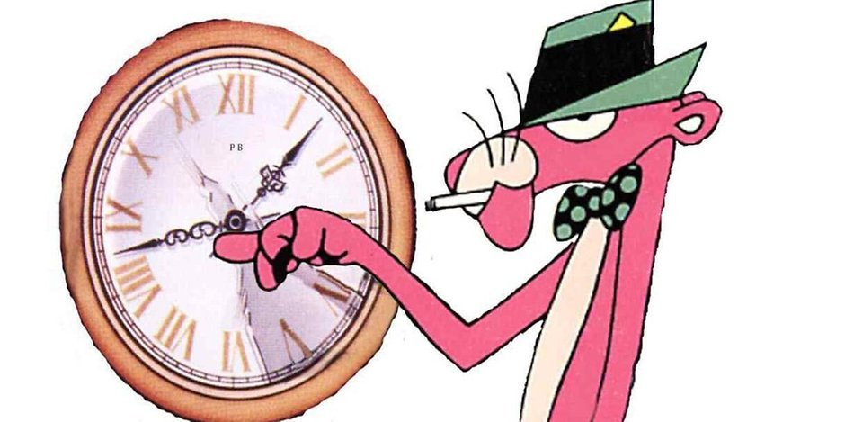
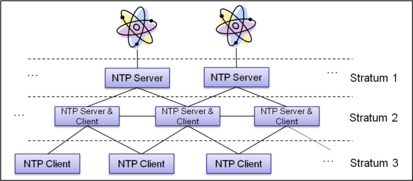
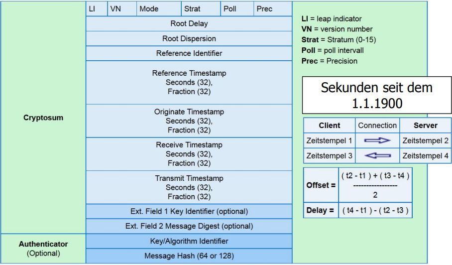
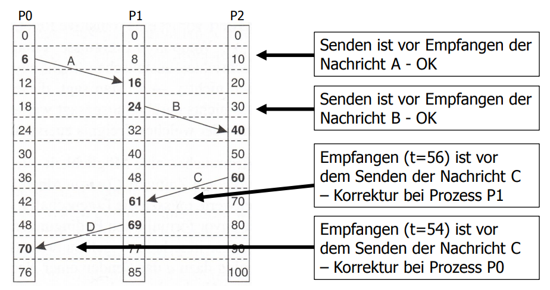

# Uhren-Synchronisation

## Lernziele

* Sie kennen zwei verschiedene Algorithmen zur Synchronisation von physischen Uhren.
* Sie wissen was eine logische Uhr ist.
* Sie kennen die _Happened-Before-Relation_.
* Sie kennen die Algorithmen des Lamport-Zeitstempels und des Vektor-Zeitstempels zur Synchronisation von logischen Uhren.
* Sie können die Algorithmen zur Synchronisation von logischen Uhren in eigenen Programmen implementieren.

## Physische Uhren

Die Bestimmung der Zeit und die Messung von Zeitdauern ist unverzichtbar zur Koordination menschlicher Aktivitäten.
Diese Koordination erreicht man durch Uhrensynchronisation. 
Synchronisation der Uhren mittels Kirchturmuhr, Telegraphie, Radio, usw.
Uhrensynchronisation ermöglichte in der Schifffahrt erst die Längengradbestimmung.
Die Existenz einer globalen Zeit haben wir verinnerlicht.

## Problematik

Durch die verschiedenen verwendeten Uhren kann es zu Uneinigkeiten über die tatsächliche Zeit kommen.
Dies kann auch in verteilten Systemen vorkommen. 
Wird zum Beispiel ein Editor nicht auf demselben Host ausgeführt wie der Compiler, kann es durch verschiedene Systemzeiten dazu kommen, dass eine Mischung aus alten und neuen Dateien kompiliert wird (tolles Beispiel, sehr praxisnah).

## Voraussetzung für Uhren-Synchronisation

Die folgenden Begriffe bilden die Grundlage für das Thema.

1. **Timer:** Schaltung in Computern, welche die Zeit verwaltet
    - Quarzkristall unter Spannung schwingt mit bestimmter Frequenz
    - Zählerregister zählen Schwingungen und erzeugen Interrupts in bestimmten Intervallen
2. **Uhr-Tick:** durch Timer erzeugter Interrupt 
    - _z.B. ein Timer mit H060 erzeugt 216'000 Ticks/h_
3. **Uhr-Asymmetrie:** Unterschiede von Zeitwerten verschiedener Uhren, auch wenn diese ursprünglich synchronisiert waren
    - Zeitwerte laufen auseinander
    - Grund dafür sind unterschiedliche Schwiungungs-Frequenzen der Kristalle

## Algorithmen zur Uhrensynchronisation

Aufgrund der Uhr-Asymmetrie ist es nötig, die unvermeidlich auseinanderlaufenden Uhren zu synchronisieren. 
Die im Folgenden erklärten Algorithmen ermöglichen dies.

### Algorithmus von Cristian

Cristians Algorithmus dient der Zeitsynchronisation von clientseitigen Prozessen mit einem Timeserver. 
Der Algorithmus funktioniert gut in Netzwerken mit tiefer Latenz, in welchen die Round-Trip-Zeit kurz ist.
Für verteilte Systeme oder Applikationen mit hoher Redundanz ist der Algorithmus nicht geeignet.

> Die _Round-Trip-Zeit_ (RTT) bezeichnet hier die Zeit zwischen Start einer Abfrage (Request) und dem Ende der zugehörigen Anwtort (Response).

#### Zeitserver (time server)

Der Zeitserver ist eine Maschine mit Zeitzeichen-Empfänger. 
Mit diesem Server werden alle anderen Maschinen synchronisiert.
Zu Beginn jeder UTC-Sekunde sendet der Zeitzeichensender einen kurzen Impuls.

> "_UTC_" steht für _Universal Coordinated Time_, die Zeitmessung in Beziehung zum Sonnenstand mit Schaltsekunden.

#### Implementation

- Client _P_ erfragt die Zeit vom Zeitserver _S_ zum Zeitpunkt _t0_
- Die Anfrage wird von _S_ verarbeitet - dies benötigt eine Zeitspanne _I_
- Die Antwort _C(t1)_ (UTC) wird ovn P zum Zeitpunkt _t1_ empfangen.
- _P_ wird auf die Zeit _C(t1)_ + RTT/2 gesetzt, d.h. die vom Server gemeldete Zeit plus die Rücklaufzeit des Pakets
    - Berechnung RTT = _t1_ - _t0_ 
    - ist die Zeitspanne _I_ bekannt, kann die Berechnung verbessert werden: RTT = _t1_ - _t0_ - _I_
- Eine häufigere Messung der Laufzeit wird durchgeführt, um genauere Werte zu erreichen.
- Messungen auserhalb eines Bereiches werden verworfen.
- Von den verbleibenden Werten wird das Mittel verwendet.

#### Probleme

##### Zeit in Vergangenheit

Die Zeit vom Zeitserver liegt in der Vergangenheit der lokalen Zeit. Die Uhr kann nicht einfach zurückgedreht werden, da inkonsistente Zustände im System entstehen könnten.
Hierbei handelt es sich um ein _grosses Problem_.

**Lösung:** Die lokale Zeit wird verlangsamt, bis die Zeitdifferenz ausgeglichen ist.

##### Rücklaufzeit

Das kleinere der beiden Probleme des Algorithmus von Cristian ist die Zeit (_I_), welche vom Server benötigt wird, bis er eine Antwort sendet.
Diese Laufzeit kann nicht genau bestimmt werden, denn sie ist abhängig von der Netzwerklast.

**Lösung:** Die Zeit _I_ wird durch mehrfache Messung der Dauer der Anfrage kompensiert. 
Der vom Zeitserver gelieferte Wert kann so adaptiert werden.

### Berkeley-Algorithmus

Anders als beim Algorithmus von Cristian hat beim _Berkley_-Algorithmus keine Maschine einen Zeitzeichen-Empfänger.
Der Zeitserver (Zeit-Daemon) fragt periodisch alle Maschinen nach ihrer Zeit.
Basierend auf den Antworten dieser berechnet der Zeitserver die Durchschnittszeit.
Anschliessend weist er alle Maschinen an, ihre Uhren an diese neue Zeit anzupassen.

## Network Time Protocol (NTP)

Das seit 1982 entwickelte Protokoll (aktuelle Version NTP v4 seit 1994) dient der Synchronisierung von Rechneruhren im Internet.
Auf fast allen Rechnerplattformen (von PCs bis Crays, Unix, Windows, VMs, embedded systems) sind NTP-Dämone verfügbar.
Durch die Verwendung des Protokolls und des Dämons kann in einem WAN (world access network, Internet) eine Genauigkeit von ca. 0.01s erreicht werden.
In LANs ist gar eine Genauigkeit kleiner als 1ms möglich.

### Struktur

- **Stratum 1:** primärer Zeitgeber, über Funk oder Standleitungen an amtliche Zeitstandards angebunden
- **Stratum >1:**  synchronisiert mit Zeitgeber des Stratums _i-1_

> Das Stratum kann dynamisch wechseln, z.B. bei Unterhalt oder Ausfall der Verbindung

### NTP-Datenpaket

## Logische Uhren

Im Jahr 1978 zeigte Leslie Lamport, dass eine Einigkeit bzw. Übereinstimmung der Zeit aller Maschinen innerhalb eines bestimmten Systems ausreicht.
Eine Übereinstimmung mit der Zeit ausserhalb des Systems bzw. eine "echte" UTC ist nicht notwendig.
Logische Uhren finden ihre Anwendung vor allem in Breichen mit hohem Anspruch an Kausalität und Verlässlichkeit.
Die Verfahren zur Synchronisation von logischen Uhren in grossen Systemen ist im Allgemeinen jedoch ineffizient.

### Happened-Before-Relation

Lamport stellte auch die _Happened-Before-Relation_ auf.
Der Ausdruck a -> b wird gelesen als "_a_ passiert vor _b_". 
Dies bedeutet, dass sich **alle Prozese einig sind**, dass **zuerst das Ereignis _a_** und **dann das Ereignis _b_** stattfindet. Es gilt ebenfalls die Transitivität falls a -> b und b -> c, dann gilt a -> c

### Lamport-Zeitstempel

#### Ausgangslage

Jede Maschine hat eine eigene Uhr mit konstanten aber unterschiedlichen Geschwindigkeiten.

Beim Lamport-Zeitstempel sendet ein Prozess eine Nachricht mit der eigenen Uhrzeit an einen anderen Prozess.
Einem Ereignis _a_ wird ein zeitwert _C(a)_ zugeordnet. Alle Prozesse sind sich über den Zeitwert einig.
Wenn _a_ vor _b_ gilt, gilt auch _C(a)_ < _C(b)_.
Ein Prozess sendet eine Nachricht mit eigener Uhrzeit _a_ an einen anderen Prozess, welcher die Nachricht zur eigenen Zeit _b_ empfängt. Dann müssen _C(a)_ und _C(b)_ so zugewiesen werden, dass _C(a)_ < _C(b)_ ist.

Die Uhrzeit C muss **immer vorwärts laufen**.
Korrekturen können durch **Addition von positiven Werten** vorgenommen werden.

#### Lösung

Zwischen zwei Ereignissen muss die lokale Uhr mindestens einmal ticken - _empfangene Zeit_ + 1.

> Es gibt nie zwei EReignsise, die zu genau der selben (logischen) Zeit auftreten.

Die Lösung liegt darin, die **Prozessnummer dem Zeitstempel hinzuzufügen**.

Damit kann allen Ereignissen in einem verteilten System eine Zeit zugewisen werden, die folgenden Bedingungen genügt:

1. wenn _a_ im selben Prozess vor _b_ auftritt, gilt _C(a)_ < _C(b)_.
2. wenn _a_ und _b_ das Senden und Empfangen einer Nachricht darstellen, gilt _C(a)_ < _C(b)_.
3. für allen anderen Ereignisse _a_ und _b_ gilt _C(a)_ != _C(b)_.

## Lamports Uhren

See also: https://www.youtube.com/watch?v=CMBjvCzDVkY

### Eigenschaften

Lamports Uhren erfüllen die Uhrenbedingung! 
Die logischen Lamport-Zeitstempel _L(e)_ definieren daher eine parteille Ordnung auf der Menge der Ereignisse,
die den kausalen Zusammenhang zwischen Ereignissen erhält.
Eine Ergänzung zu einer totalen Ordnung ist wieder möglich.

Problem: Anahnd der Zeitstempel lässt sich nicht immer sicher sagen, ob zwei Ereignisse kausal voneinander abhängen.
Hierfür müsste auch die Umkehrung der Uhrenbedingung gelten, es gilt aber lediglich _C(a)_ < _C(b)_ --> a vor b V a || b.

## Vektor-Zeitstempel

See also: <https://www.youtube.com/watch?v=jD4ECsieFbE>

Ein Vektor-Zeitstempel _VT(a)_, der einem Ereignis _a_ zugewiesen wurde, hat die Egenschaft, dass Ereignis _a_
 dem Ereignis b kausal vorausgeht, wenn _VT(a)_ < _VT(b)_ für ein Ereignis _b_ gilt.

 Jeder Prozess _Pi_ besitzt einen Vektor _Vi_, der für jedenProzess im System die Anzahl der Ereignisse enthält 
 mit den Eigenschaften: 

 1. _Vi_[i] ist die Anzahl der Ereignisse, die bisher in _Pi_ aufgetreten sind
 2. _Vi_[j] = k, erkennt _Pi_, dass in _Pj_ k Ereignisse aufgetreten sind
 3. Der Vektor _Vi_ wird den gesendeten Nachrichten mitgegeben.

Jeder Prozess hat einen Vektor an Uhren (Integer Clock). Angenommen es gibt `N` Prozesse (in einer Gruppe von Prozessen `1..N`). Jeder Vektor hat `N` Elemente. Der Prozess `i` hat einen Vektor $V_i[1..N]$.

Das j-the Element im Vektor vom Prozess i (also $V_i[j]$) ist die Zeit (aus Perspektive Prozess i) vom letzten Event des Prozesses j.

Zu Beginn ist der Vektor der Nullvektor.

### Vektor-Zeit inkrementieren

Bei einer Instruktion oder einem gesendeten Event bei Prozess i, der Prozess inkrementiert nur sein i-tes Element des Vektors. Jede Nachricht trägt den Vektor-Zeitstempel des sendenden Prozesses mit.

Erhält Prozess $i​$ von Prozess $j​$ eine Nachricht passiert:

- $V_i[i] = V_i[i] + 1​$
- $V_i[j] = max(V_\text{message}[j], V_i[j]) \text{for}  j \neq i$

Also: Der Prozess inkrementiert seinen Vektor an i-ter Stelle und aktualisiert den Zeitstempel an der j-ten Stelle um den höheren Wert zwischen dem gespeicherten und dem mit gesendeten Wert.

### Kausalität

* Zwei Vektor-Zeitstempel sind gleich ($VT_1 = VT_2$) falls $VT_1[i] = VT_2[i]$ für alle $i = 1, ..., N$
* Ein Vektor-Zeitstempel ist kleiner oder gleich ein anderer Vektor ($VT_1 \le VT_2​$) falls $VT_1[i] \le VT_2[i]​$ für alle $i = 1, ..., N​$
* Zwei Events sind **kausal**, z.B. $VT_1$ erfolgt vor $VT_2$ ($VT_1 < VT_2$) falls:
  * $VT_1 \le VT_2$ und
  * Es existiert ein $j$ sodass $$1 \le j \le N$$ und $$VT_1[j] < VT_2[j]$$