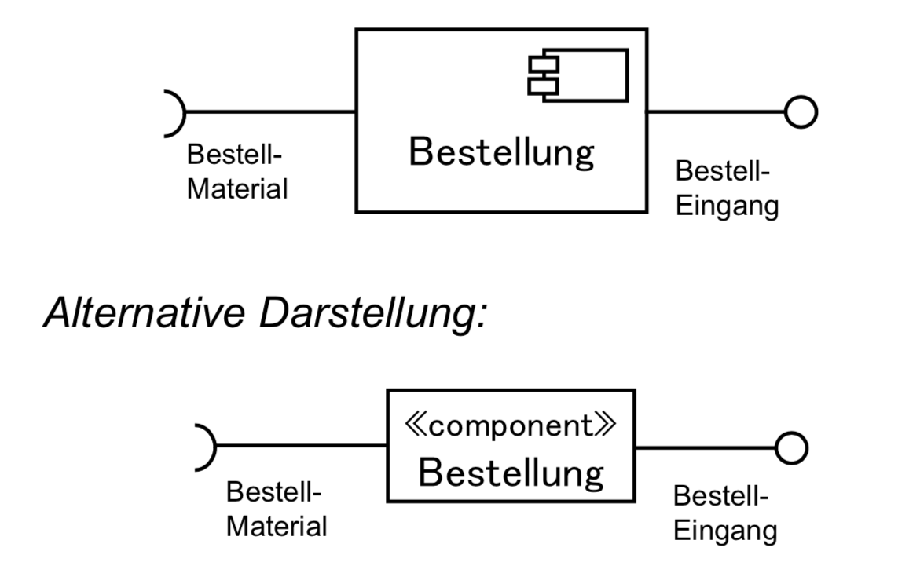
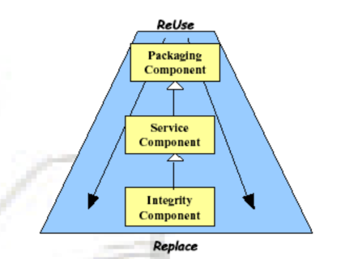
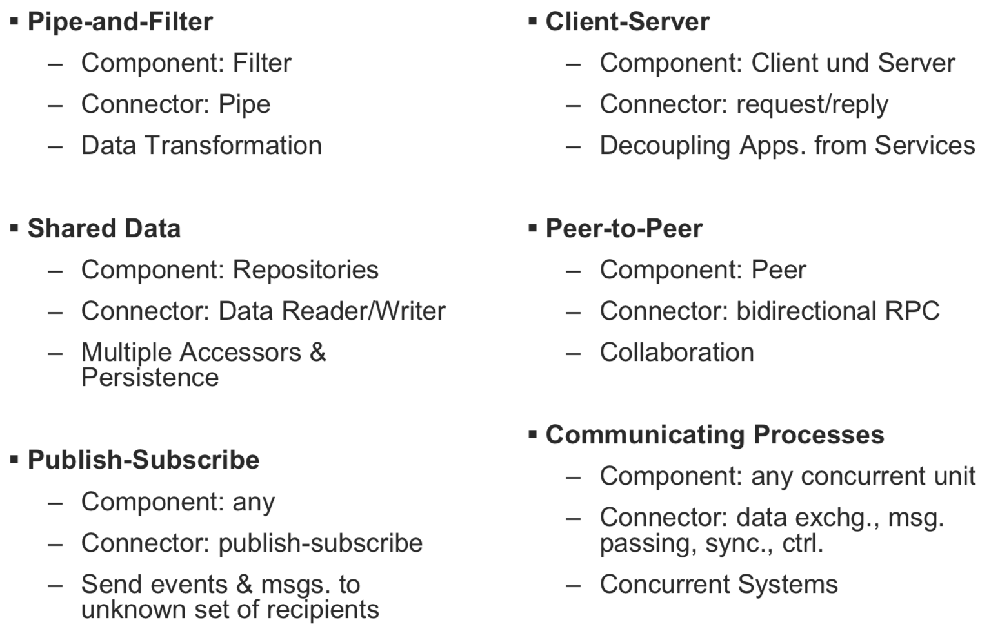

# Komponenten

## Lernziele
Punkte die vom Dozenten als sehr wichtig beurteilt wurden:
- Eigenschaften von Komponenten
- Komponenten-Spezifikation

## Definition des Komponentenbegriffs
Definition der European Conference on Object-Oriented Programming (ECOOP), 1996:
> A software component is a unit of composition with contractually specified interfaces and explicit context dependencies only. A software component can be deployed independently and is subject to composition by third parties.

Definition von Councill, Heineman: Component-Based Software Engineering, Addison-Wesley, 2001:
> Eine Software-Komponente ist ein Software-Element, das zu einem bestimmten Komponentenmodell passt und entsprechend einem Composition Standard ohne Änderungen mit anderen Komponenten verknüpft und ausgeführt werden kann.

Auswändig lernen für die Prüfung.

## Eigenschaften von Komponenten
- Sie sind eigenständig und ausführbare Software Einheiten, d.h. Subsysteme, Prozesse, Objekte
- Sie sind über ihre Schnittstellen austauschbar definiert
- Sie lassen sich unabhängig voneinander entwickeln
- Sie sind kunden-/anwendungsspezifisch, bzw. wiederverwendbar
- Sie können installiert/deployed werden

## Modellierung in UML

## Subsysteme
Komponenten lassen sich hierachisch verschachteln.

## Komponentenmodelle
Komponentenmodelle sind konkrete Ausprägungen des Paradigmas der Komponentenbasierten Entwicklung.
Neben der genauen Form und den Eigenschaften einer Komponente muss es einen Interaction-Standard und einen Composition-Standard festlegen.

Folgende Komponentenmodelle sind weit verbreitet:
- Microsoft .NET
- Enterprise Java Beans
- DCOM (Distributed Component Object Model)
- CORBA Component Model

## Nutzen von Komponenten
Im Bereich _Packaging_ gibt es folgende _Reuse Benefits_:
- Standartisierung und Konsistenz
- Verkürzte Lieferzeit (Wiederverwendung ist schneller als Build, weniger Testing benötigt)
- Komplexität eindämmen
- Fähigkeit, "Best in Class" zu nutzen 

Im Bereich _Service_ gibt es folgende _Interface Benefits_:
- Erhöhte Produktivität
- Höhere Qualität durch präzise Spezifikationen

Im Bereich _Integrity_ gibt es folgende _Replacement Benefits_:
- Inkrementelle Entwicklung und Test
- Paralelle und inkrementelle Entwicklung (daank präziser Spezifikataion und managed Abhängigkeiten)
- Verbesserte Wartung (Abschirmung limitiert den Impact eines Changes)

## Komponentenbasierte Entwicklung

### Praktische Eigenschaften von Komponenten
- Wer eine Komponente einsetzen will, braucht nur deren Schnittstelle zu kennen
- Komponenten, die dieselbe Schnittstelle haben, sind gegenseitig austauschbar
- Komponententest ist blackbox Test
- Komponenten lassen sich unabhängig voneinander entwickeln
- Komponenten unterstützen die Wiederverwendbarkeit

### Verhaltenssicht
Die Verhaltenssicht auf Komponenten beinhaltet folgendes:
- *Components & Connector:* ausführbare Einheiten und gemeinsame Daten
- *Datenfluss*
- *Control flow:* von wem wird es angestossen?
- *Prozess:* welche Komponenten laufen parallel?
- *Verteilung:* Zuordnung der Komponenten zur HW

### Komponenten-Spezifikation
Die Komponenten-Spezifikation beinhaltet folgendes:
- *Export:* unterstützte Interfaces, die andere Komponenten nutzen können
- *Import:* benötigte / benutzte Interfaces von anderen Komponenten
- *Verhalten:* Verhalten der Komponente
- *Kontext:* Rahmenbedingungen im Betrieb der Komponente

### Architektur-Muster

