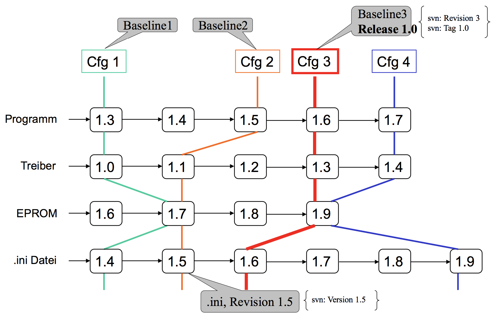
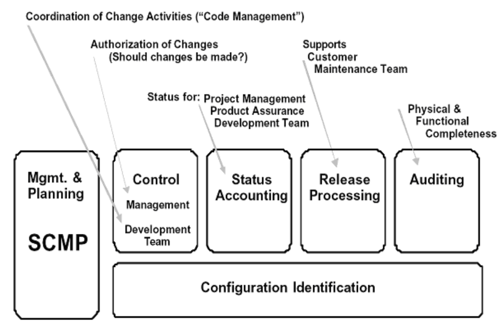
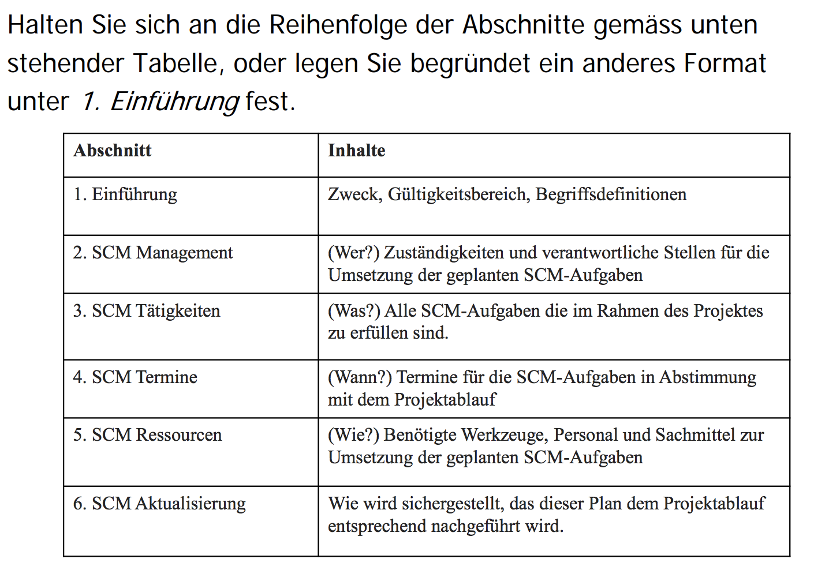
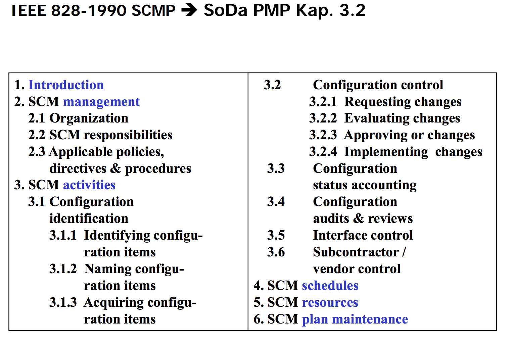

# Configuration Management

## Lernziele

### Sie kennen Bedeutung, Begrifflichkeit und Methoden des Konfigurationsmanagements

### Sie wisssen welche Informationen aus dem Entwicklungsprozess gemäss SoDa wann, wie und wo dokumentiert werden sollen

## Konzept und Begriffe

### Software Configuration Management (SCM)
Im Konfigurationsmanagement geht es um das Identifizieren der Konfiguration eines Systems zu verschiedenen, definierten Zeitpunkten um über den gesamten System-Lebenszyklus Änderungen an der Konfiguration kontrolliert durchzuführen und die Integrität und Rückverfolgbarkeit sicherzustellen.

SCM ist eine technische und organisatorische Führungsaufgabe:
  - identifizieren und dokumentieren der Eigenschaften für jedes Configuration Item 
  - steuern nötiger Änderungen dieser Eigenschaften
  - den Stand der Umsetzung von Änderungen erfasssen 
  - die Einhaltung festgelegter Anforderungen überprüfen

### Software Configuration
> Buckley: The configuration of a system is the function and/or physical characteristics of hardware, firmware, software or a combination thereof as set forth in technical documentation and achieved in a product.

### Software Configuration Item
A software configuration item (SCI) is an aggregation of software that is designated for configuration management and is treated as a single entity in the SCM process.

Items tht are controlled in addition to the code itself include:
  - plans
  - specifications
  - code libraries
  - data and data dictionaries
  - documentation for installation, maintenance, operations etc.

### Version
Eine Version ist ein spezifisches, identifizierbares Artefakt auf einem bestimmten Entwicklungsstand.

### Revision
Eine Revision ist eine neue Version eines Artefaktes mit dem Zweck eine ältere abzulösen.

### Baseline
Eine Baseline ist ein Satz von Revisionen, d.h. ein Snapshot der Konfiguration.

### Release
Ein Release ist eine getestete und freigegebene Baseline.

## Organisation des Konfigurations-Management

Die SCM Hauppttätigkeiten sind:
  - Software Configuration Identification
  - Software Configuration Control
  - Software Configuration Status Accounting
  - Software Configuration Auditing
  - Software Release Management and Delivery

Weitere Themen sind die Organisation und Zuständigkeiten, Ressourcen und Terminpläne, Wahl der Werkzeuge und Implementierung, Überwachung der Lieferanten und Subunternehmer, Überwachung der Schnittstellen.

Die Erkenntnisse und Ergebnisse werden im Software Configuration Management Plan (SCMP) festgehalten.

Untenstehend zwei Folien mit unbekanntem Zweck:

