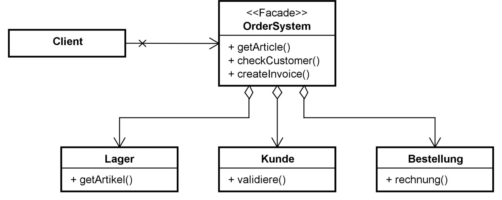
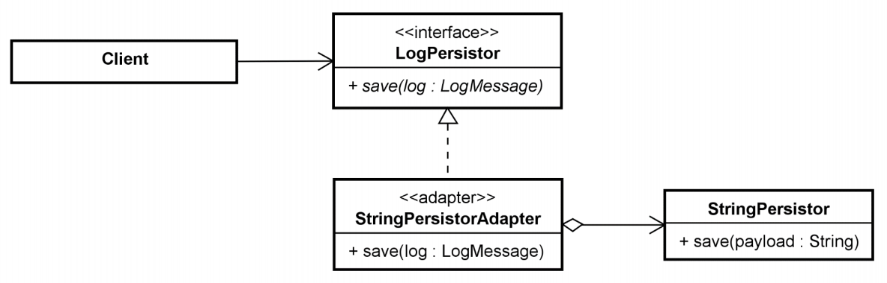
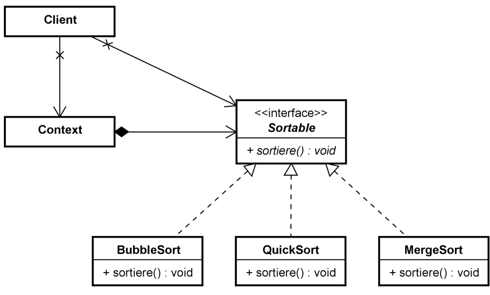

# Design Patterns

Im Vorfeld gilt anzumerken, dass die im folgenden verwendeten deutschen Bezeichnungen oft nicht nur lächerlich klingen, sondern wohl auch im Selbststudium oder bei Google-Suchen zu eher bescheidenen Ergebnissen führen. 
Es wird stark empfohlen, die englischen Bezeichnungen zu verwenden.

## Gruppierung

Primär wird nach Zweck gruppiert. 
Daraus entstandene Gruppen:

- [Creational Patterns (Erzeugungsmuster)](#erzeugungsmuster)
- [Structural Patterns (Strukturmuster)](#strukturmuster)
- [Behavioral Patterns (Verhaltensmuster)](#verhaltensmuster)

Sekundäre Unterteilung:

- Klassenmuster: Beziehungen zu Kompilierungszeitpunkg bereits festgelegt.
- Objektmuster: Beziehungen zur Laufzeit dynamisch veränderbar.

## Erzeugungsmuster

### Ziel

Hier ist das Ziel die Abstrahierung der Erzeugung von Objekten
Entscheidung über: 

- zu verwendenden konkreten Typ
- Zeitpunkt der Erzeugung
- Art der Erzeugung (Kontext, Initial-Erzeugung)

### Beispiele

Die folgenden Muster gehören zur Gruppe der Erzeugungsmuster:

- Abstrakte Fabrik (Abstract Factory, Kit)
- Erbauer (Builder)
- Fabrikmethode (Factory Method, Virtual Constructor)*
- Prototyp (Prototype)
- [Einzelstück (Singleton)](#singleton)

#### Singleton

Durch die Verwendung von Singletons kann sichergestellt werden, dass nur eine einzige Instanz einer Klasse instanziert werden kann. Dazu wird der Konstruktor mit dem Zugriffsmodifikator `private` ausgestattet.

**Beispiel-Code:**

```java
public final class Singleton {

    private String displayName
    private static Singleton instance = new Singleton("hello vsk");

    private Singleton(String displayName) {
        this.displayName = displayName;
    }

    public static Singleton getInstance() {
        return this.instance;
    }
}
```

**Remarks:**

Im obigen Beispiel wird die statische Klassenvariable `instance` direkt bei der Deklaration instanziert (Eager initialization).
Man kann hier alternativ auch eine *Lazy*-Initialization verwenden, welche das Objekt erst beim ersten Aufruf der `getInstance()` Methode instanziert. 
Der Eager-Ansatz ist einfach umzusetzen, da man sich nicht im selben Umfang um Synchronisations-Probleme kümmern muss. 
Für weitere Informationen über die Implementation eines "perfekten Singletons" [siehe hier](https://medium.com/@kevalpatel2106/how-to-make-the-perfect-singleton-de6b951dfdb0);

**Empfehlung:**

Das Singleton-Pattern hat mittlerweile einen schlechten Ruf. 
Man soll dieses nur zurückhaltend und gezielt einsetzen, niemals als universellen, globalen Zugriffspunkt.

## Strukturmuster

### Ziel

Die Verwendung von Strukturmustern bezweckt jeweils einen der folgenden Punkte:

- Objekte (oder Klassen) zu grösseren oder veränderten Strukturen zusammenfassen
- Unterschiedliche Strukturen einander anzupassen und miteinander zu verbinden

### Beispiele

- Adapter (Adapter, Wrapper)
- Brücke (Bridge, Handle/Body)
- Dekorierer (Decorator, Wrapper)
- Fassade (Facade)
- Fliegengewicht (Flyweight)
- Kompositum (Composite)*
- Stellvertreter (Proxy, Surrogate)*

#### Facade

Das Facade-Pattern stellt eine zusammengefasste Schnittstelle zu einer Menge von Schnittstellen mehrerer Subsysteme zur Verfügung.

**Beispiel:**



Die Fassade weiss nichts über die konkreten Implementationen der einzelnen Methoden.
Sie kennt lediglich die Subklassen und deren Zuständigkeiten und delegiert die Anfragen entsprechend. 
Die Subklassen wiederum wissen nichts über ihre Verwendung in der Fassade, es besteht keinerlei Referenz.

Für Beispielcode und weiterführende Erklärung [klicke hier](https://www.geeksforgeeks.org/facade-design-pattern-introduction/).

**Ziel:**

Dieses Entwurfsmuster vereinfacht die Anwendung mehrerer Subsysteme und minimiert die Abhängigkeiten zu den Subsystemen - die Kopplung wird minimiert. 
Der Austausch bzw. die Ablösung eines Subsystems (beispielsweise infolge Refactoring) wird enorm vereinfacht, da der Aufruf der konkreten Implementation zentral in der Fassade erfolgt. 

**Empfehlung:**

Das Facade-Pattern kann einfach zur Entkopplung eingesetzt werden. 
Es ist hauptsächlich darauf zu achten, dass die Fassade keinerlei weitere Funktionenn bzw. Business-Logic enthält!

#### Adapter (Wrapper)

Durch das Adapter-Pattern wird die Schnittstelle einer Klasse an die von den Klienten erwartete (Ziel-)Schnittstelle angepasst.

Für alternative Erklärung inkl. Beispiel [siehe Artikel auf geeksforgeeks](https://www.geeksforgeeks.org/adapter-pattern).



##### Teilnehmer

- Interface (*hier `LogPerisistor`*): gewünschte Schnittstelle, kann abstrakte Klasse oder Interface sein
- Adapter (*hier `StringPersistorAdapter`): verwendet adaptierte Klasse/Objekt, spezialisiert oder implementiert Zielschnittstelle
- Adaptierte Klasse (*hier `StringPersistor`*): Klasse, deren Schnittstelle adaptiert/gerwappt werden soll

##### Motivation

- Einfachere Wiederverwendung von existierenden Klassen oder Komponenten, deren Schnittstelle aber unpassend ist.
- Implementation einer möglichst allgemeinen Schnittstelle und diese durch Adapter anpassen.

## Verhaltensmuster

### Ziel

Die Verhaltensmuster decken jeweils einen oder mehrere der folgenden Punkte ab:

- Beschreibung der Interaktion zwischen Objekten
- Festlegen der Kontrollflüssen zw. Objekten
- Delegation der Zuständigkeit und/oder Kontrolle

### Beispiele

- Befehl (Kommando, Command, Action, Transaction)
- Beobachter (Observer, Dependents, Publish/Subscribe, Listener)*
- Besucher (Visitor)
- Interpreter (Interpreter)
- Iterator (Iterator, Cursor)*
- Memento (Memento, Token)
- Plugin (Plugin)
- Schablonenmethode (Template Method)
- Strategie (Strategy, Policy)
- Vermittler (Mediator)
- Zustand (State, Objects for States)
- Zuständigkeitskette (Chain of Responsibility)

#### Strategy-Pattern

Beim *Strategy*-Pattern werden verschiedene Implementationen derselben Methode generalisiert bzw. austauschbar gemacht.
Ein Interface schreibt die zu implementierenden Methoden (gleich Verhalten) vor. 
Verschiedene Implementationen dieses Interfaces stellen dann die konkreten Verhaltensweisen zur Verfügung.

Die Klassen, welche die vorgeschriebenen Methoden verwenden, halten sich jeweils die konkrete Implementation in einer Variable des Interface-Typs, damit das Verhalten ausgetauscht werden kann. 
Vorzugsweise wird die konkrete Implementation im Konstruktor übergeben oder per *Dependency Injection* injiziert.



##### Teilnehmer

- Strategie (*hier `Sortable`*): Vollabstrakte Klasse oder Interface, definiert Schnittstelle
- Kontext (*hier `Context`*): optional, kann direkt durch Client erledigt werden
    - Besitzt Referenz auf konkrete Strategie, erstellt diese ggf. selber
    - Stellt ggf. Datenschnittstelle für Strategien zur Verfügung
    - Meinung: Nur verwenden, wenn dies nicht Concern des Clients ist, bzw. wenn das SRP verletzt würde.
- Konkrete Strategien (*hier `BubbleSort`, `MergeSort` etc.): Implementieren konkreten Algorithmus, greifen ggf. auf Kontext zu

##### Motivation

- Anbieten von unterschiedlichen Implementationen eines Algorithmus
- Eng verwandte Klasen, die sich nur im Verhalten unterscheiden, zusammenfassen
- Vermeiden von unzähligen Bedingungsanweisungen in der/den aufrufenden Klasse(n)

##### Empfehlung

Dieses Pattern wird leicht unterschätzt und kann sich bereits bei sehr kleinen Methoden lohnen. 
Es lassen sich z.B. grosse `switch`-Statements oder viele aufeinanderfolgende `if`-Anweisungen eliminieren.
Die Entscheidung, welche konkrete Implemenation verwendet werden soll, kann der aufrufenden Klasse (z.B. Client) abgenommen und an einem adäquaten Ort vorgenommen werden.