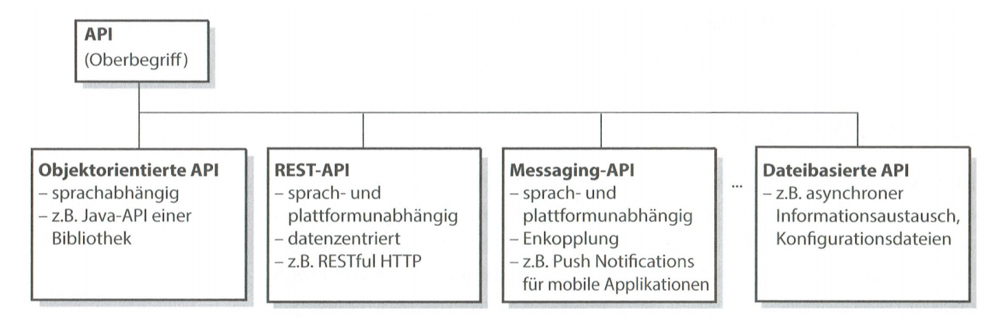
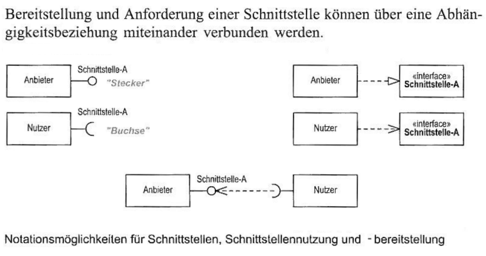

# Interfaces

## Motivation
Das Konzept der Schnittstellen ist in dreifacher Hinsicht bedeutsam:
  1. Schnittstellen machen Software leichter verständlich, da man die Implementierung nicht kennen muss.
  2. Schnittstellen helfen uns, die Abhängigkeiten zu reduzieren. Schnittstellen gestatten es, die Abhängigkeiten in der Schnittstelle zu konzentrieren und jede Abhängigkeit von der Implementierung zu vermeiden.
  3. Schnittstellen erleichtern die Wiederverwendung von bewährten Implementierungen und sparen damit Arbeit. 

## Architektur und Schnittstellen
Von technischen Details abgesehen, stecken die wichtigsten Aspekte für Architekten in den Schnittstellen und Beziehungen zwischen den Komponenten.
Das hat mehrere Gründe:
- Die Beziehungen ermöglichen die einzigartige Funktion des Systems. Keine Komponente kann (auf Systemebene) die gewünschte Funktionalität allein bieten.
- Die einzelnen Komponenten oder Teilsysteme kommunizieren und kooperieren über Schnittstellen miteinander. 
- Die Spezialisten für einzelne Teilsysteme konzentrieren sich auf ihre (lokalen) Probleme - sie betrachten die übrigen Systeme oder Komponenten als „Peripherie"
- Über Schnittstellen findet auch die Kommunikation mit der Aussenwelt statt - ohne die jedes System nutzlos bleibt.

## Kriterien für gute Schnittstellen
- Schnittstellen sollen minimal sein
- Schnittstellen sollen einfach zu verstehen sein
- Schnittstellen sollen gut dokumentiert sein

## Design by Contract (DbC)
Der Schnittstellen Vertrag besteht aus:
- Preconditions: Zusicherungen, die der Aufrufer einzuhalten hat
- Postconditions: Nachbedingungen, die der Aufgerufene garantiert
- Invarianten: Bedingung, die Instanzen einer Klasse ab der Erzeugung erfüllen müssen (kann während der Ausführung einer Funktion sie verletzt sein)

Der Vertrag kann sich auf Variablen- und Parameter beziehen wie auch auf Objektzustände.

### Verantwortlichkeiten
Der Nutzer muss sicherstellen, dass die Preconditions eingehalten werden und für Postconditions defensiv (z.B. mit asserts) programmieren.

Der Anbieter muss die Preconditions und Invarianten (vor- und nach der Ausführung) mittels defensiver Programmierung sicherstellen und Postconditions gewährleisten. 

## Schnittstellen Spezifikation
Zur Programmschnittstelle gehört alles, was für die Benutzung der Komponente wichtig ist,  was der Programmierer verstehen und beachten muss.

Jede Programmschnittstelle definiert eine Menge von Methoden
mit den folgenden Eigenschaften:
- Syntax (Rückgabewerte, Argumente, in/out, Typen)
- Semantik (Was bewirkt die Methode?)
- Protokoll (z.B. synchron, asynchron)
- Nichtfunktionale Eigenschaften (Performance, Robustheit, Verfügbarkeit, bei Web-Anwendungen möglicherweise auch Kosten)

## Interface Types

### Operational Interfaces
A component offers a range of services, which are accessed by calling interface operations.

Operational Interfaces group operations belonging together. 
If a client uses one operation, it is quite likely that it will use some of the other operations too.
Sets of such operations belong together and have related effects on the state of the component object.

From the interface providers view the following needs to be specified:
- The name
- The input parameters: specifying the information passed to the component
- The output parameters: specifying the information provided or returned by the component
- Any resulting change of state 
- Specification how the inputs, outputs and component states are related

### Signal Interfaces
A set of signals that can be sent or received by a component.

From the interface providers view the following needs to be specified:
- The name
- Outgoing signals
- Ingoing signals

### Stream Interfaces
Collections of data-streams, that can be consumed or produced by a component.

From the interface providers view the following needs to be specified:
- The name
- The produced streams (outgoing)
- The consumed streams (ingoing)
- The quality of services (e.g. max dataflow)

## APIs
A brief, opinionated history of the API, by Joshua Bloch:
> Eine API spezifiziert die Operationen sowie die Ein- und Ausgaben einer Softwarekomponente. 
> Ihr Hauptzweck besteht darin, eine Menge an Funktionen unabhängig von ihrer Implementierung zu definieren, sodass die Implementierung variieren kann, ohne die Benutzer der Softwarekomponente zu beeinträchtigen.

## Schnittstellen in UML

