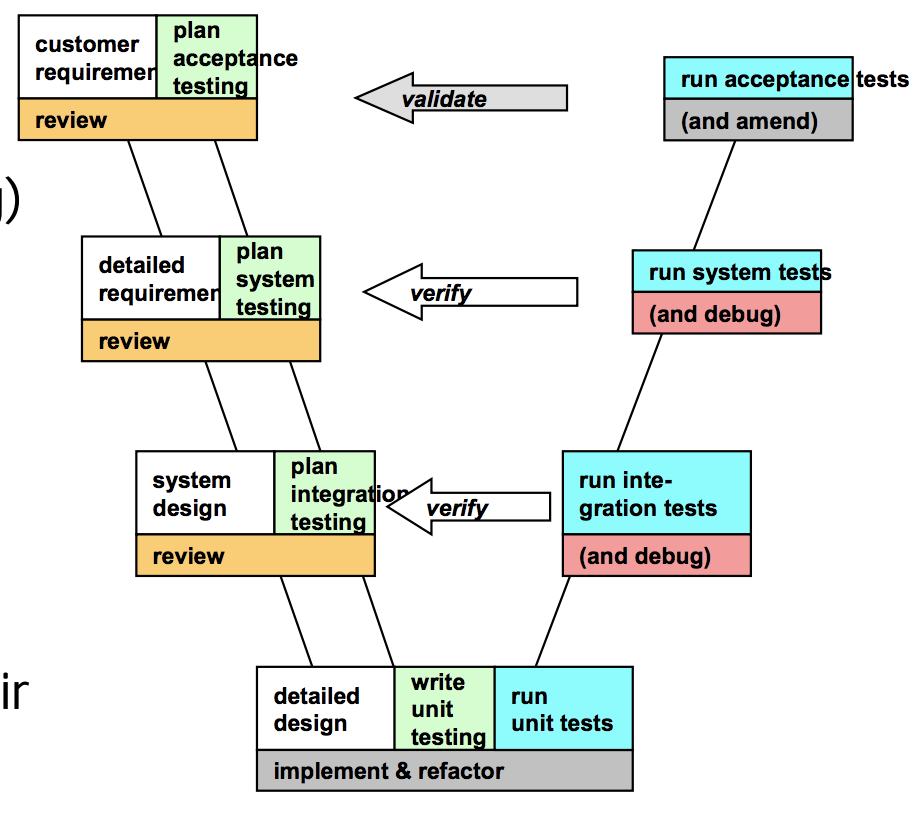
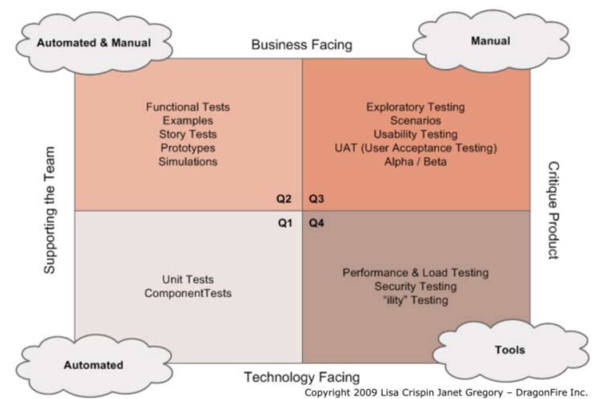
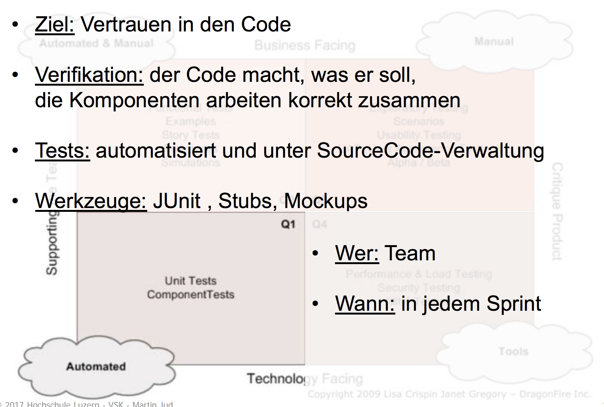
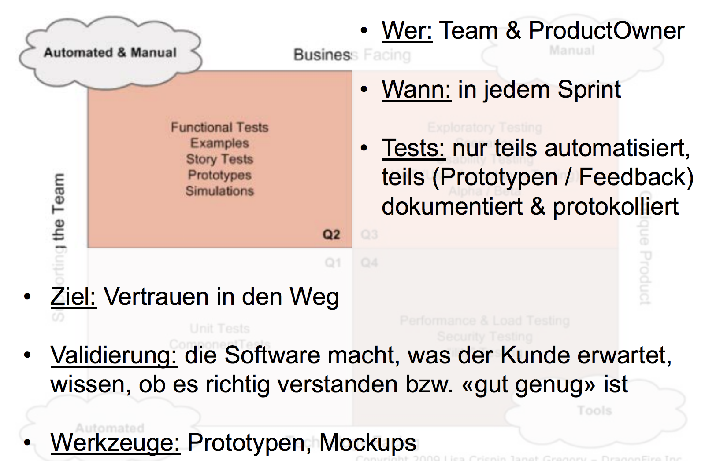
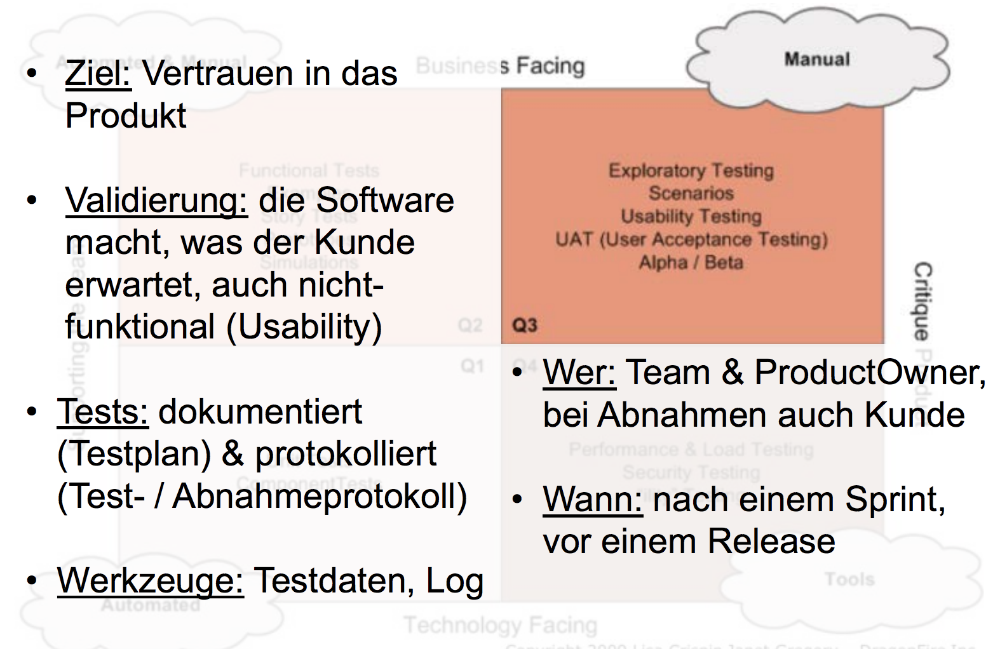
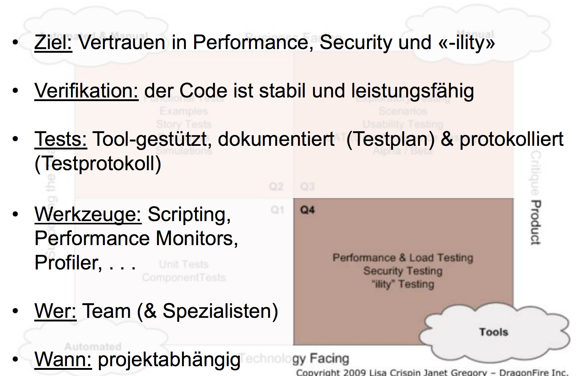
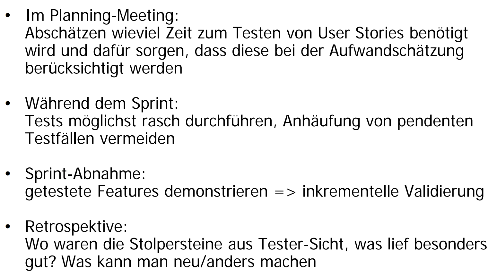

# Integration and System Testing

## Lernziele

* Sie können Komponenten entwerfen, dokumentieren, in Java realisieren, testen und deployen.
* Sie kennen die Zusammenhänge zwischen Analyse/Design und Test/ Abnahme von Softwarekomponenten.
* Sie können geeignete Systemtests definieren, diese dokumentieren und die Durchführung protokollieren.
* Sie wissen, welche Informationen über die zu entwickelnde Software wann, wie und wo dokumentiert werden sollen.
* Sie wissen, welche Informationen aus dem Entwicklungsprozess gemäss SoDa wann, wie und wo dokumentiert werden sollen.
* Sie können Sprintbacklogs für ein kleines Team formulieren, schätzen und geeignete Abnahmekriterien festlegen.

## Grundlagen

Mit dem V-Modell lässt sich der Zusammenhang zwischen den verschiedenen Disziplinen (Requirement Engineering, Design, Implementierung) und deren Verifikation mittetls Tests aufzeigen.

Beim Testen ist es wichtig Tests zu dokumentieren oder zu automatisieren, um so Regressionstests zu erreichen. 
Mit keiner Testart und mit keinem Review findet man alle Fehler. 
Nur im Zusammenwirken der unterschiedlichen Techniken findet man ein Maximum an Fehlern. 

## Integration Testing

Integrationstests prüfen die Schnittstellen und das Zusammenspiel der Systemkomponenten.

Alle zu integrierenden Units / Komponenten sollten bereits erfolgreich getestet sein (allerdings kann eine Komponente oft erst im Verbund mit andern vollständig getestet werden).

> Code, der im statischen Testumfeld erfolgreich lief, kann in dynamischer Umgebung immer noch Fehler auslösen!

Getestet werden:
  - Interfaces (Objekt Kompatibilität, Aufruf Sequenzen, Wer validiert Inputs, usw.)
  - Datenabhängigkeiten (für jede Komponente ermitteln, welche Datenabhängigkeiten bestehen und diese testen)
  - CallGraaph Abdeckung (verschiedene Aufrufvarianten testen)

Dabei gibt es verschiedene Integrationsstrategien:
  - Bottom-Up the Small (Kleinere Teilsysteme lassen sich bottom-up integrieren)
  - Top-Down the Controls (bei aufwändigen Strukturen mit Hilfe von Stubs top-down vorgehen)
  - Big-Bang the Backbone (Was für den weiteren Testablauf benötigt wird in einem Aufwisch zusammenführen?!?!)
  - Continuous Integration (Bei iterativ-inkrementeller Entwicklung neu dazu gekommenes laufend integrieren und testen)

## System Testing

Systemtests prüfen die gesamte Wirkungskette im Softwareprodukt, Aspekte, die mit Unit-Tests und Integrationstests nicht abgedeckt werden.

Testfälle sollen in einer Testumgebung ablaufen, welche der späteren Einsatzumgebung möglichst nahe kommt. 

Sobald mehrere Komponenten zusammen funktionieren müssen, gibt viele mögliche Konfigurationen, die entsprechend der Vorgaben des Konfigurationsmanagements zu testen sind.

Systemtestfälle können grundsätzlich den im Backlog formulierten Anforderungen und Akzeptanzkriterien abgeleitet werden.

## Regressionstests

Bereits realisierte und getestete Features müssen nach jeder Änderung / Erweiterung der Software erneut getestet werden.

Integrations- und Systemtests werden als Regressionstest auch in späteren Sprints immer wieder gebraucht und genutzt.
Damit Integrations- und Systemtests wiederholbar sind, müssen sie nachvollziehbar dokumentiert werden.
Wichtige Bestandteile der Beschreibung eines Testfalls sind:
  - die Vorbedingungen für die Testausführung
  - die Handlungen und Eingaben für die Durchführung des Tests
  - die erwarteten Ergebnisse und Nachbedingungen 

## Agile Testting 

> Da hat sich jemand aber richtig Mühe gegeben um diese Folien zu designen :)

## Testing in SoDa (scheiss SoDa)

Ein Sprintziel muss es sein, die Fertigstellung von Features zu mit Hilfe von Abnahmetests prüfen zu können.

Konsequenz davon ist, dass im Taskboard zu den in diesem Sprint geplanten UserStories auch die erforderlichen Integrationstests, Systemtests und Abnahmetests eingeplant werden müssen.
Natürlich müssen auch die jedes Mal zunehmenden Regressionstests eingeplant werden.

