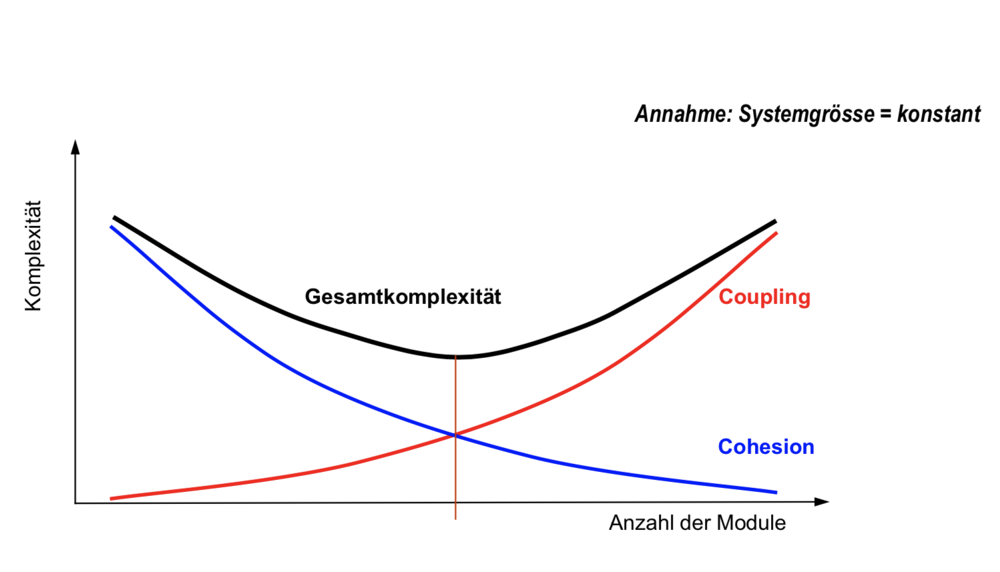
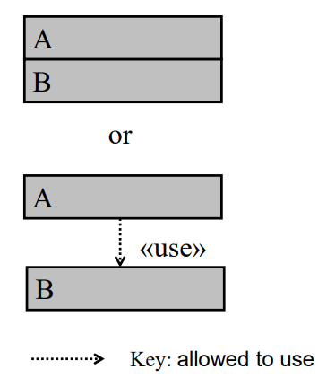
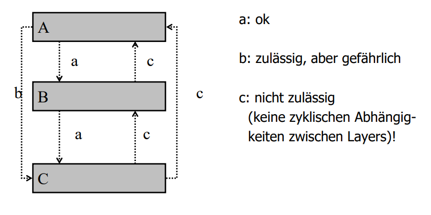
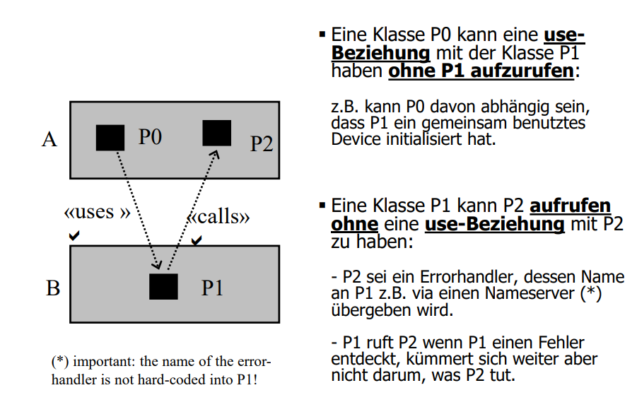
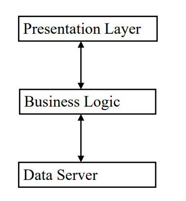
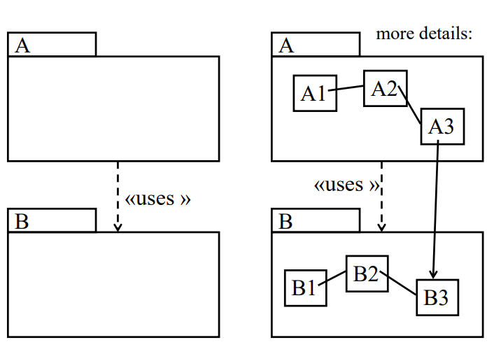

# Modularisation

## Lernziele

* Sie verstehen das Konzept der Software-Komponenten und kennen die Kriterien zur Modularisierung.

## Kopplung und Kohäsion

**Kopplung** \(Coupling\) beschreibt das Ausmass der Kommunikation zwischen Modulen bzw. die Unabhängigkeit der einzelnen Module. Ziel ist es die Kopplung zu minimieren.

**Kohäsion** \(Cohesion\) beschreibt das Ausmass der Kommunikation innerhalb eines Moduls bzw. der interne Zusammenhalt innerhalb eines Moduls. Ziel ist es die Kohäsion zu maximieren. Starke Kohäsion ist beispielsweise das Single Responsibility Prinzip (jede Klasse hat nur genau eine definierte Aufgabe). Das Zusammenspiel der Attributen und Methoden einer solchen Klasse ist somit sehr eng (Zugehörigkeit)

## Module

### Begriff

> Ein in sich abgeschlossener Teil des gesamten Programmcodes, bestehend aus einer Folge von Verarbeitungsschritten und Datenstrukturen.

### Arten

#### Bibliotheken

Sammlung von oft benötigte und thematisch zusammengehören Funktionen.

#### Abstrakte Datentypen

Ein Modul implementiert einen neuen Datentyp und stellt die darauf definierten Operationen zur Verfügung. Beispiele für oft benötigte abstrakte Datentypen sind mehrdimensionale Tabellen, komplexe Zahlen und Koordinaten.

#### Modellierung physischer Systeme

Insbesondere in technischen Anwendungen der Informatik, z.B. Sensorsystem-Module, Gerätetreiber-Module, Anzeigetafel-Module, usw.A

#### Modellierung logisch-konzeptionelle Systeme

Logisch-konzeptionelle Systeme modellieren und für andere Komponenten auf hoher Abstraktionsstufe nutzbar machen z.B. Grafikmodule, Datenbankmodule, Meldungsvermittlungs-Module, Dialogmodule

## Kriterien für den modularen Entwurf

Folgende Kriterien gelten für den modularen Entwurf von Systemen:

* **Zerlegbarkeit**: Teilprobleme sind unabhängig voneinander entwerfbar.
* **Kombinierbarkeit**: Module sind unabhängig voneinander \(wieder-\)verwendbar.
* **Verständlichkeit**: Module sind unabhängig voneinander zu verstehen.
* **Stetigkeit**: kleine Änderungen der Spezifikation führen nur zu kleinen Änderungen im Code.

### Zerlegbarkeit \(modular decomposability\)

Zerlege ein Softwareproblem in eine Anzahl weniger komplexe Teilprobleme und verknüpfe diese so, dass die Teile möglichst unabhängig voneinander bearbeitet werden können. Die Zerlegung wird häufig rekursiv angewendet: Teilprobleme können so komplex sein, dass sich eine weitere Zerlegung aufdrängt.

### Kombinierbarkeit \(modular composability\)

Strebe möglichst frei kombinierbare Software-Elemente an, die sich auch in einem andern Umfeld wieder einsetzen lassen. Kombinierbarkeit und Zerlegbarkeit sind voneinander unabhängige Eigenschaften.

### Verständlichkeit \(modular understandabilty\)

Der SourceCode eines Moduls soll auch verstehbar sein ohne dass man die anderen Module des Systems kennt. Software-Unterhalt setzt voraus, dass die Teile eines Systems unabhängig von einander zu verstehen und zu warten sind.

### Stetigkeit \(modular continuity\)

Von einer kleinen Änderung der Anforderungen soll auch nur ein kleiner Teil der Module betroffen sein.

## Prinzipien des modularen Entwurf

Folgende Prinzipien gelten für den modularen Entwurf von Systemen:

* **lose Kopplung**: schmale Schnittstellen: nur das wirklich Benötigte austauschen
* **starke Kohäsion**: hoher Zusammenhalt innerhalb eines Moduls
* **Information Hiding**: Modul ist nach aussen nur über seine Schnittstelle bekannt
* **wenige Schnittstellen**: minimale Anzahl von Schnittstellen -&gt; zentrale Struktur
* **explizite Schnittstellen**: Aufrufe und gemeinsam genutzte Daten sind im Code ersichtlich

## Vorgehen zur Modularisierung

**Prüfungsstoff (gem. Folien)**

Lesen Sie dazu den Klassiker [On the Criteria To Be Used in Decomposing Systems into Modules von David L. Parnas](https://www.cs.umd.edu/class/spring2003/cmsc838p/Design/criteria.pdf).

Gemäss Folien:

* Es gibt die Basiskonzepte der Kopplung und Kohäsion
* Es gibt Kriterien (siehe oben)
* Es gibt die typischen Modularten (siehe oben)
* Es gibt Prinzipen (siehe oben)

**Ein System sinnvoll in Module aufteilen ist eine der anspruchsvollsten Aufgaben in der Informatik**

## Layers, Tiers und Packages

### Layers

Öffentliche Methoden in Layer B dürfen von der Software in Layer A genutzt werden. Man spricht von einer use-Beziehung wenn das korrekte Funktionieren von A von einer korrekten Implementation von B abhängt.

### Keine Layer!

### Layer-Beziehungen

## Tiers

In einer n-tier client-server Architektur werden Layers oft mit Tiers verwechselt.

## Layers in UML

## Zusammenfassung

* Modul = in sich abgeschlossener Teil des gesamten Programm-Codes
* Modulkonzept 1972 David Parnas
* Kopplung und Kohäsion optimieren!
* Arten von Modulen: Bibliotheken / abstrakte Datentypen / Modellierung physischer bzw. logischer Systeme
* Entwurfskriterien: Zerlegbarkeit / Kombinierbarkeit / Verständlichkeit / Stetigkeit
* Entwurfsprinzipien: lose Kopplung / starke Kohäsion / Information Hiding / wenige & explizite Schnittstellen
* Entwurfsvorgehen: Basiskonzepte + Kriterien + Modularten + Prinzipien => anspruchsvolle Aufgabe
* UML: Layers, Tiers & Packages
* David L. Parnas: On the Criteria To Be Used in Decomposing Systems into Modules
  http://repository.cmu.edu/cgi/viewcontent.cgi?article=2979&context=compsci