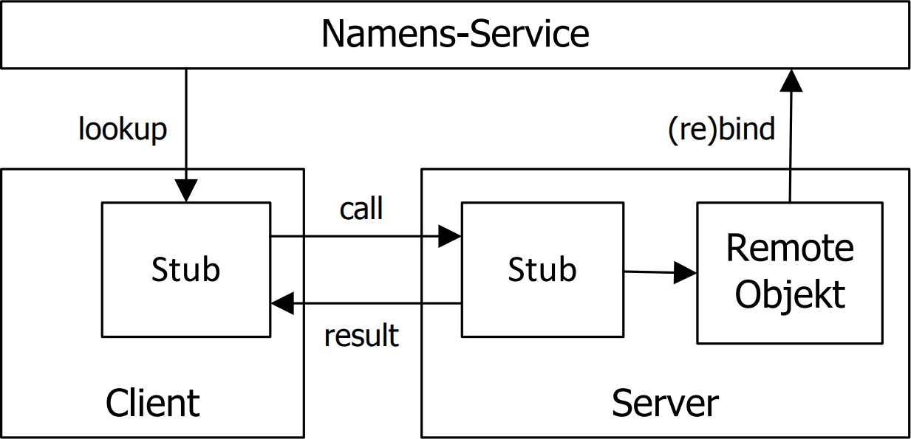

# Verteilung & Kommunikation (RMI)

## Begriffserklärungen

### Verteilte Systeme

Ein verteiltes System ist ein System, in dem sich Hardware- und
Softwarekomponenten auf vernetzten Computern befinden und
miteinander über den Austausch von Nachrichten kommunizieren.

### Verteilte Anwendungen

Eine verteilte Anwendung nutzt ein verteiltes System als
Kommunikationsinfrastruktur für ihre verteilten Komponenten

### Middleware

Middleware (englisch für Dienste-Schicht oder
Zwischenanwendung) oder Vermittlungssoftware bezeichnet in der
Informatik anwendungsneutrale Programme, die so zwischen
Anwendungen vermitteln, dass die Komplexität dieser Applikationen
und ihre Infrastruktur verborgen werden.

Sie sind transparent in Bezug auf [verschiedene Aspekte](#transparenz).

#### Kategorien

Middlewares werden in die folgenden Kategorien unterteilt:

- **Kommunikationsorientiert**: Der Schwerpunkt liegt in der Abstraktion der Netzwerkprogrammierung (RPC, RMI, Web-Service)
- **Nachrichtenorientiert**: Arbeitet über Austausch von Nachrichten mithilfe von Warteschlangen (JMS, SOAP)
- **Anwendungsorientiert**: Im Mittelpunkt steht neben Kommunikation v.a. die Unterstützung verteilter Anwendungen (Hazelcast, JEE, Microsoft .NET und WCF, CORBA)

### Transparenz

- **Ortstransparenz:** Benutzer kennt Lokation einer Ressource oder eines Dienstes nicht
- **Zugriffstransparent:** Zugriff auf Ressource erfolgt immer identisch, egal ob sich diese lokal oder entfernt im Netz befindet.
- **Nebenläufigkeitstransparenz:** Mehrbenutzerbetrieb wird von Diensten und Ressourcen unterstützt. Das System ermöglicht exklusive Zugriffe und Datensynchronisation und -replikation.
- **Fehler- und Ausfalltransparenz:** Typische durch Verteilung entstehende Fehler (Übertragungsfehler, Komponentenausfall etc.) bleiben der Anwendung weitgehend verborgen.
- **Sprachtransparenz:** Die Kommunikation zwischen den Komponenten ist unabhängig von der jeweils verwendeten Programmiersprache.
- **Replikationstransparenz:** Aus Performancegründen kann es mehrere Kopien derselben Ressource geben. Das System sorgt für die transparente Änderung der darin vorgenommenen Änderungen.

## RMI (Remote Method Invocation)

- Bereitstellung von einer oder mehrere Methoden in einem Remote-Interface. DIese Methoden sollen als Dienste zur Verfügung stehen.
- Server-Klasse implementiert Interface
    - Instanzen davon heissen Remote-Objekte
    - Remote-Objekte werden bei Namens-Service registriert
    - Clients können Dienst dort anfordern
- Clients fordern mithilfe des Namensservices die Remote-Referenz der benötigten Objekte und können dann die entsprechenden Methoden darauf aufrufen
- Übertragung der Parameter und des Rückgabewertes sind für Server sowie Client transparent.

### Technische Realisierung



- **Client-Stub**: Stellvertreterobjekt, identische Schnittstelle wie Remote-Objekt; befindet sich auf selbem Rechner wie Client 
- **Server-Stub**: befindet sich auf Server, nimmt Aufrufe von Client-Stub entgegen
- **Remote Method Procotol**: regelt Kommunikation auf Basis von TCP/IP Verbindungen
- **RMI-Transportschicht**: Hier kommunizieren die beiden Stubs miteinander. Der Server-Stub kennt das tatsächliche Remote-Objekt, leitet die Anfragen des CLient-Stubs entsprechend weiter und gibt den Rückgabewert an den Client zurück

#### Parameterübergabe

- Elementare Datentypen: können wie gewöhnlich *by value* übergeben werden.
- Lokale Objekte: können nur übergeben werden, wenn sie serialisierbar sind (Implementation des `Serializable` Interfaces); werden als Kopie übergeben (also auch *by value*)
- Verweise auf Remote-Objekte: werden z.B. vom Namensservice zurückgegeben und werden als Objektreferenzen (*by reference*) behandelt.

### RMI in Java

- Sprachelement seit JDK 1.1
- RMI-Compiler zur Stub-Erzeugung: rmic.exe (seit 1.5 von der Runtime übernommen)
- Remote-Protokolle
    - JRMP: Java Remote Method Protocol
    - RMI-IIOP: Java Remote Method Invocation (RMI) über Internet Inter-Orb Protocol (IIOP)

#### Vorgehen

##### 1. Remote-Interface definieren

- Jedes Remote-Objekt muss Interface `Remote` implementieren
    - beschreibt die Funktioenn, die auf Server zur Verfügung stehen
    - auch Parameter/Rückgabewerte eines Interfacetypes
- Jede angebotene Methode kann eine `RemoteException` auslösen
- Parameter/Rückgabewerte: müssen serializable sein, Laden von Byte-Code automatisch möglich

```java
public interface RemoteFibonacci extends Remote {
    public BigInteger calc(int value) throws RemoteException;
}
```

##### 2. Remote-Interface implementieren

- Um eingehende externe Methodenaufrufe zu behandeln muss jedes Remote-Objekt in die RMI Infrastruktur exportiert werden. Möglichkeiten:
    1. Ableitung der Klasse `UnicastRemoteObject` und Implementation des RMI-Interfaces
    2. Remote-Objekt implementiert RMI-Interface und wird mithilfe der Klassen-Methode `UnicastRemoteObject.exportObject(...)` exportiert.
- Infrastruktur generiert dann die zugehörige URL für Remote Method Protocol

```java
public class FibonacciImpl extends UnicastRemoteObject
implements RemoteFibonacci {
 public FibonacciImpl() throws RemoteException {
 super();
 }
 @Override
 public BigInteger calc(int value) throws RemoteException {
 BigInteger fibonacci;
 fibonacci = FibonacciCalculator.getFibonacci(
 new BigInteger(Integer.toString(value)));
 return fibonacci;
 }
}
```

##### 3. RMI-Repository starten

- Infrastruktur für das Binding ist der RMI Namensdienst
    - rmiregistry.exe: Repository erreichbar über RMI-URL
    - ansprechbar über Methoden des Pakets `java.rmi.registry`
- Reskriktion: RMI-Server kann nur Referenzen von Remote-Objekten in Registry registrieren, die  auf demselben Host laufen
    - Sicherheitsrisiko: Ansonsten könnte RMI-Client Registryeinträge entfernen oder verändern
- RMI-Registry ist Abbildung ovn Namen auf Remote-Objekte
    - Hierarchische Namensräume, dynamische Objektsuche, Lastverteilung oder ähnliche Eigenschaften fehlen
    - Alternative: Java Naming and Directory Interface (JNDI)

##### 4. Remote-Objekte erzeugen

 - Factory-Methode `LocateRegistry.createRegistry(int portNumber)`
 - Standard-Port 1099
 - Programm `RegistrySetup` darf nicht beenden

 ```java
public final class RegistrySetup {
 public static void main(final String[] args) throws RemoteException, InterruptedException {
 final Registry reg = LocateRegistry.createRegistry(
 Registry.REGISTRY_PORT);
 LOG.info("o.k.");
 synchronized (reg) {
     reg.wait();
 }
 }
}
 ```

##### 5. Remote-Objekte registrieren

- Klasse Naming stellt Funktionen zur Registrierung von  Remote-Objekten zur Verfügung:

```java
public static void bind(String name, Remote obj)
 throws AlreadyBoundException, MalformedURLException,
 RemoteException
public static void rebind(String name, Remote obj)
 throws RemoteException, MalformedURLException
public static void unbind(String name)
 throws RemoteException, MalformedURLException, NotBoundException
public static Remote lookup(String name)
 throws NotBoundException, MalformedURLException, RemoteException
public static String[] list(String name)
 throws RemoteException, MalformedURLException
```

####### Vorgang

1. Remote-Objekt erzeugen
2. Nach Start des RMI-Namensdiensts kann Remote-Objekt registriert werden

```java
public class FibonacciServer {
    public static void main(String[] args)
        throws RemoteException, AlreadyBoundException, MalformedURLException {
        final FibonacciImpl fibo = new FibonacciImpl();
        final String url = "rmi://localhost:1099/fibo";
        Naming.bind(url, fibo);
    }
}
```

> Werden Bytecode-Klassen dynamisch per RMI geladen, so wird eine Installation des SecurityManagers notwendig.

##### 6. Client implementieren

- Client sucht Referenz zum Remote-Objekt mittels `Naming.lookup(String url)`

```java
public class FibonacciClient {
    public static void main(String[] args) {
        try {
            final int value = 123;
            final String url = "rmi://localhost:1099/fibo";
            final var fibo = (RemoteFibonacci) Naming.lookup(url);
            BigInteger reslult = fibo.calc(value);
            // do something with result
        }
        catch (NotBoundException | MalformedURLException |RemoteException e) {
            LOG.fatal(e.getMessage());
        }
    }
}
```