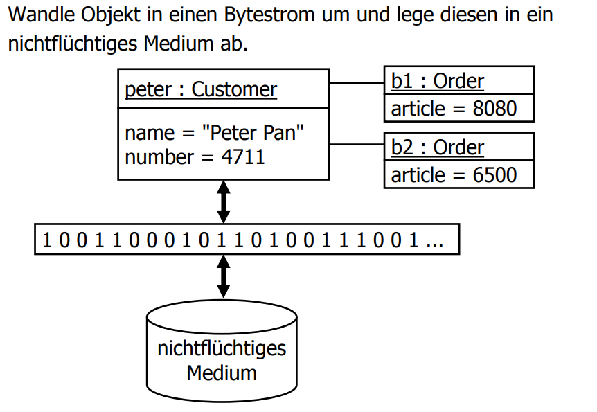

# Serialization

## Lernziele

* Sie wissen was Persistenz von Objekten bedeutet.
* Sie kennen den Standardmechanismus zur Serialisierung von Java-Objekten.
* Sie kennen das Prinzip der Java Object Serialization.
* Sie wissen wie eine beliebige Klasse zu serialisieren und deserialisieren ist.
* Sie kennen die Möglichkeiten der Serialisierung bei Vererbung.
* Sie wissen warum die Versionierung bei der Serialisierung wichtig ist und können Versionsnummern entsprechend einsetzen.
* Sie können die Code-Beispiele nachvollziehen und modifizieren.

## Persistenz von Objekten

Die Persistenz von Objekten muss folgende Anforderungen erfüllen:

* **Transparenz**: Persistenz erfordert keine Sonderbehandlung bei der Programmierung (Benutzer arbeiten in gleicher Weise mit transienten sowie mit persistenten Objekten)
* **Interoperabilität**: Laufzeitumgebung und persistenter Speicher sind austauschbar. Persistente Objekte können in anderen Umgebungen verwendet werden.
* **Skalierbare Wiederauffindbarkeit**: Das Auffinden von persistenten Objekten erfolgt transparent, ohne spezifisches Durchsuchen von Objektpools.

Unter Java lassen sich Objekte über verschiedene Ansätze automatisch persistieren:

* **Standardserialisierung**: Binär via Java Object Serialization \(JOS\)
* **XML-Serialisierung über JavaBeans Persistence \(JBP\)**: Via XML, wird in der Praxis kaum mehr verwendet.
* **XML-Abbildung über JAXB**: Via XML. Teil der Standardbibliothek seit Java Version 6.

### Idee



### Ablauf

Ablauf des Standardmechanismus zur Serialisierung eines Java- Objekts:

1. Metadaten, wie Klassenname und Versionsnummer, in den Byte-Strom schreiben
2. alle nichtstatischen Attribute \(private, protected, public\) serialisieren
3. die entstehenden Byte-Ströme in einem bestimmten Format zu einem zusammenfassen

Bei der Deserialisierung wird dann der Datenstrom gelesen und ein Java Objekt mit dem gespeicherten Zustand erzeugt

### Standard-Serialisierung

Es stehen zwei Klassen und ihre \(De-\)Serialisierungs-Methode zur Verfügung:

* **ObjectOutputStream**: Mit der Methode `writeObject()` können Objekte in einen Ausgabestrom geschrieben werden. Während der Serialisierung geht der ObjectOutputStream die Zustände und Objektverweise rekursiv ab und schreibt die Zustände Schritt für Schritt in einen Ausgabestrom
* **ObjectInputStream**: Mit der Methode `readObject()` können serialisierte Objekte in ein Objekt der Laufzeit umgewandelt werden.

**Beispiel**:

```java
final FileOutputStream outputStream = new FileOutputStream("datei"); 
final ObjectOutput output = new ObjectOutputStream(outputStream);
output.writeObject(new Integer(3));
output.flush();

final FileInputStream inputStream = new FileInputStream("datei"); final ObjectInputStream input = new ObjectInputStream(inputStream); 
final Integer integer = (Integer)input.readObject();
```

### Java Object Serialization \(JOS\)

Wenn eine beliebige Klasse das Interface java.io.Serializable implementiert, kann Java deren Instanzen serialisieren. Das Interface java.io.Serializable ist ein Marker-Interface, besitzt also keine Methoden. Ist dieses Interface implementiert, kann die Serialisierung entsprechend mit den Klassen `ObjectInputStream` und `ObjectInputStream` zu serialisieren.

Folgende Informationen und Daten zu einem Objekt werden serialisiert:

* Der vollständig qualifizierte Name der Klasse.
* Die Signatur der Klasse.
* Alle nicht-statischen, nicht-transienten Attribute.
* Weitere Objekte, auf welche die Objekt Attribute verweisen.
* Alle aus den Oberklassen geerbten Attribute.

#### Transiente Attribute

Ein transientes Attribut ist ein berechnetes Attribut. Oft \(aber nicht immer\) müssen transiente Attribute beim Deserialisieren initialisiert werden. Dazu gibt es die Methode `readResolve()`. Sie wird, wenn vorhanden, vom `ObjectInputStream` aufgerufen und kann eine Initialisierung vornehmen. Als Beispiel:

```java
 //... weitere Methoden der Klasse Customer
 public Object readResolve() {
 return new Customer(firstName, lastName);
 }
}
```

Das Java-Keyword `transient` kann eine Variable markieren, sodass diese nicht serialisiert wird.

```java
public class Customer implements Serializable {
 private final String firstName;
 private final String lastName;
 // name wird im Konstruktor zusammengesetzt und muss nicht serialisiert werden
 private transient final String name;
 public Customer(final String firstName, final String lastName) {
 	this.firstName = firstName;
 	this.lastName = lastName;
 	this.name = firstName + " " + lastName;
 }
}
```


#### Singletons

Wird ein Singelton Objekt serialisiert und wieder deserialisiert, dann erhält man eine Kopie. Das ist nicht gewollt! Bei Singletons kann auch die Methode `readResolve()` verwendet werden um zu überprüfen ob bereits eine Instanz vorhanden ist. 

#### Steuerung der Serialisierung

Noch mehr Kontrolle bietet das Implementieren der Methoden readObject\(\) und writeObject\(\), die das Lesen und Schreiben des Objektzustands direkt definieren. Das ist nützlich, um grosse, komplexe Objekte kompakt zu repräsentieren oder zusätzliche Daten zu serialisieren. In den jeweiligen Methoden kann die Methode `defaultWriteObject()` oder `defaultReadObject()` verwendet werden.

#### Vererbung

Ist eine Oberklasse einer serialisierbaren Klasse nicht serialisierbar, so werden ihre privaten Felder nicht serialisert. Beim Deserialisieren wird der Konstruktor ohne Argumente der ersten nichtserialisierbaren Oberklasse aufgerufen. In der Oberklasse muss ein Konstruktor ohne Argumente existieren! Alle Unterklassen einer serialisierbaren Klasse sind ebenfalls serialisierbar. Dabei muss die Unterklasse nicht extra mit dem Interface `Serializable` markiert werden.

## Verwendung der Serialisierung zum Klonen von Objekten

Durch Verwendung von Serialisierung und Deserialisierung hintereinander kann man einfach eine tiefe Kopie eines Objektes erzeugen. Dabei werden die Objekte in den Arbeitsspeicher kopiert. Diese Methode ist zwar nicht effizient, erfordert aber keine Kooperation der zu klonenden Objekte.

## Versionierung

Alle benötigten Klassen müssen beim Serialisieren und Deserialisieren im Classpath liegen. Serialisierung und Deserialisierung von Objekten können in unterschiedlichen JVMs erfolgen, die potenziell auf unterschiedlichen Plattformen laufen. Es kann sein, dass beliebig viel Zeit zwischen dem Schreiben und Lesen von Dateien liegt.

Serialisierte Objekte haben eine Versionsnummer. Objekte mit falscher Versionsnummer können nicht deserialisiert werden. Die Versionsnummer wird als statisches Attribut definiert. Beispiel:

```java
public static long serialVersionUID = 8365728189244278312L;
```


Ist keine Nummer angegeben, so benutzt Java einen Hashwert, der sich u.a. aus den Namen der Klassenattribute errechnet. Änderungen an der Klasse \(z.B. Hinzufügen einer Methode\) machen serialisierte Daten inkompatibel. Dies verhindert versehentliches Einlesen inkompatibler Daten. Durch Angabe einer serialVersionUID kann man Kompatibilität steuern, eventuell mit eigener readObject-Methode.


## Zusammenfassung

* Viele Anwendungen benötigen die Erhaltung von Objekten über das Programmende hinaus. Die Persistierung von Objekten macht dies möglich.
* Es stehen die zwei Klassen ObjectOutputStream und ObjectInputStream sowie ihre Methoden writeObject() und readObject() für die Serialisierung und Deserialisierung zur Verfügung.
* Man kann die Serialisierung mit den Methoden writeObject() und readObject() direkt steuern.
* Versionierung muss sein und ist wichtig, um sicherzustellen das
  serialisierte Daten, bzw. Objekte, kompatibel sind.